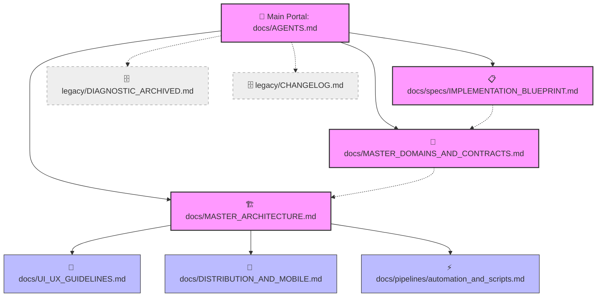

# 🗺️ AGENTS.md — Ponto de Entrada Contextual & Regras de IA (Bootstrap)

Este documento é a raiz do ecossistema e o principal ponto de entrada contextual para agentes cognitivos de IA e engenheiros de software. Projetado para otimização de busca, economia de tokens e navegação escalável por meio de links bidirecionais (compatíveis com editores de grafos como o **Obsidian**).

---

## 🌐 Grafo de Conhecimento e Index de Documentações (Geração 2.0)
Abaixo é apresentada a hierarquia simplificada e consolidada do nosso sistema documental. **Sempre comece consultando esta raiz antes de inspecionar ou alterar código.**



| Documento | Caminho | Prioridade | Propósito Principal |
| :--- | :--- | :--- | :--- |
| **AGENTS.md** | `docs/AGENTS.md` | **Crítica** | Bootstrap de IA, mapa mental do monorepo, regras do domínio e economia de tokens. |
| **MASTER_ARCHITECTURE.md** | `docs/MASTER_ARCHITECTURE.md` | **Crítica** | Especificação consolidada do backend BFF Fastify, Repositórios, Firestore e Gateway Serverless. |
| **MASTER_DOMAINS_AND_CONTRACTS.md** | `docs/MASTER_DOMAINS_AND_CONTRACTS.md` | **Crítica** | Fonte de verdade de dados (Zod, Types TS) unificada com regras de negócio e Skills do assistente. |
| **IMPLEMENTATION_BLUEPRINT.md** | `docs/specs/IMPLEMENTATION_BLUEPRINT.md` | **Alta** | Status das tarefas do backlog, pendências, implementações concluídas e planos de melhoria. |
| **UI_UX_GUIDELINES.md** | `docs/UI_UX_GUIDELINES.md`| **Alta** | Direcionamento estético iOS/Apple Music, motion/react transitions e Views do Cliente React SPA. |
| **DISTRIBUTION_AND_MOBILE.md**| `docs/DISTRIBUTION_AND_MOBILE.md`| **Alta** | Portabilidade híbrida via CapacitorJS (Android e iOS) emparelhado ao plano tático go-to-market. |
| **AUTOMATION_AND_SCRIPTS.md** | `docs/pipelines/automation_and_scripts.md` | **Alta** | Documentação técnica - Infraestrutura de build, git hooks (.husky) e automação de ENVs. |
| **DIAGNOSTIC_ARCHIVED.md** | `docs/legacy/DIAGNOSTIC_ARCHIVED.md` | **Baixa** | Histórico - Auditoria arquitetural primitiva com mapeamento estrutural de transição (Arquivado). |
| **CHANGELOG.md** | `docs/legacy/CHANGELOG.md` | **Baixa** | Log de alterações e histórico de evolução técnica pré-consolidação. |

---

## 2. Visão Geral do Sistema e Bounded Contexts
A **Aimee** é uma assistente pessoal e planejadora orquestrada inteligente com múltiplos assistentes focados nos seguintes limites conceituais (Bounded Contexts):

1. **Aimee Core & Chat (`src/domain/intelligence` e `src/client/pages/ChatView.tsx`)**: Orquestração generativa em múltiplos canais, análise estendida de tokens de IA e auditoria de prompts.
2. **Finance & Wallet (`src/client/pages/FinanceView.tsx`)**: Gerenciamento de despesas, metas financeiras e relatórios estáticos estruturados.
3. **Shopping & Listas (`src/client/pages/ShoppingView.tsx`)**: Monitoramento de estoque pessoal, listas de compras dinâmicas compartilhadas.
4. **Calendar & Routines (`src/client/pages/RoutinesView.tsx`)**: Micro-gerenciamento de hábitos, alarmes, condicionais diárias integradas ao estilo de vida.
5. **Config & Identity (`src/client/pages/SettingsView.tsx` e `src/client/components/Header.tsx`)**: Painel de gerenciamento do ecossistema e identidade visual do perfil (apelido, bio, preferências de aparência do avatar e do assistente).

---

## 3. Estrutura do Monorepo e Responsabilidades
```bash
├── docs/                 # Documentação formal indexada em Obsidian
├── src/
│   ├── client/           # Front-end: SPA React 18, Vite, Tailwind CSS e motion
│   │   ├── components/   # Componentes modulares reutilizáveis (Header, AdminPanel, etc.)
│   │   ├── pages/        # Views principais ligadas às abas funcionais do sistema
│   │   ├── services/     # Serviços auxiliares de comunicação, push e notificações locais
│   │   └── hooks/        # State Hooks de autenticação e manipulação das ações da Aimee
│   ├── server/           # Back-end: Fastify, Firebase Admin, endpoints/rotas de API dedicadas
│   ├── domain/           # Camada de Domínio: Regras de negócio puras (validação, inteligência)
│   ├── infrastructure/   # Camada de Infraestrutura: Repositórios acoplados ao Firestore
│   ├── models/           # Schemas de validação determinística utilizando a biblioteca Zod 
│   └── types/            # Definições estritas de interfaces globais TypeScript
```

---

## 4. Regras Operacionais para Agentes de IA

### 🚨 Documentos Obrigatórios antes de Analisar ou Implementar
* Antes de qualquer alteração estrutural nas entidades ou banco de dados, você **deve ler obrigatoriamente** `docs/MASTER_DOMAINS_AND_CONTRACTS.md` (e opcionalmente o histórico em `docs/legacy/DIAGNOSTIC_ARCHIVED.md`) para evitar quebrar o padrão arquitetural implementado.
* Em refatorações e adições de escopo, atualize sempre `docs/specs/IMPLEMENTATION_BLUEPRINT.md`.

### 🔄 fluxo de Implementação Recomendado (Clean Architecture / Spec-Driven)
1. **Analise o Contexto**: Localize o Bounded Context afetado e revise as interfaces e schemas em `src/types` e `src/models`.
2. **Defina a Spec (Se Alta Complexidade)**: Formule uma resposta objetiva delimitando contratos das APIs, schemas e testes recomendados.
3. **Implementação Incremental**: Escreva códigos pequenos, evitando arquivos monstruosos de milhares de linhas. Extraia componentes e helpers para manter arquivos leves abaixo do limite de tokens de buffer.
4. **Validação Estrita**: Execute `lint_applet` e `compile_applet` para assegurar que não foram introduzidos erros de compilação ou regressões de contrato.

### 🛡️ Regras de Não-Reanálise Desnecessária e Economia de Tokens
* **Evite o padrão catastrófico do "Complete File Reading Loop"**: Se você já realizou a leitura de um arquivo ou diretório na atual rodada estruturada das ferramentas de sistema, reutilize esses dados na memória episódica. Não chame redundantes `view_file` consecutivos sobre o mesmo conteúdo, exceto para verificação pontual pós-edição cirúrgica de conflito.
* **Busca Cirúrgica**: Para localizar termos, prefira o utilitário `grep` nativo via CLI especificando os diretórios alvos precisos (ex: `src/client/pages`) ou exclusão inteligente de diretórios gigantes (`node_modules`, `dist/`).
* **Seja Conciso**: AI-assisted software architecture é sobre máxima exatidão sintática e cognitiva. Respostas longas demais degradam o desempenho do modelo executável.

### 🚫 Anti-Patterns de IA
1. **Mocking ou Fake Data**: Nunca use dados estáticos fictícios ou simulação de sucesso para recursos contratados se você puder gerar uma real persistência de API baseada em Firestore em `src/infrastructure/repositories`.
2. **Overengineering**: Não crie padrões Enterprise imensos se a arquitetura puder ser resolvida com herança direta do `BaseRepository` e um modelo Zod simples.
3. **Reversão ou Perda de Contexto**: Nunca reverta alterações visuais requintadas feitas previamente pelo usuário sem uma confirmação de tradeoff. A integridade visual inspirada em interfaces minimalistas fluidas (Apple) é prioritária.

---

## 5. Convenções de Código e Arquitetural

* **Typography & Styling**: Uso exclusivo de Tailwind CSS (`@import "tailwindcss";` em `index.css`). Sem múltiplos arquivos CSS legados. Fontes geométricas limpas (Inter, Space Grotesk ou Fira Code/JetBrains Mono para visualizadores de status e dados).
* **Animations**: Animações suaves criadas obrigatoriamente com a biblioteca `motion/react` para mudanças de telas, abertura de modais e ações do assistente.
* **Zod Schemas**: Localizados exclusivamente em `src/models/index.ts` como fonte única da verdade para validação de dados e types (inferidos via z.infer) tanto no frontend quanto no backend.
