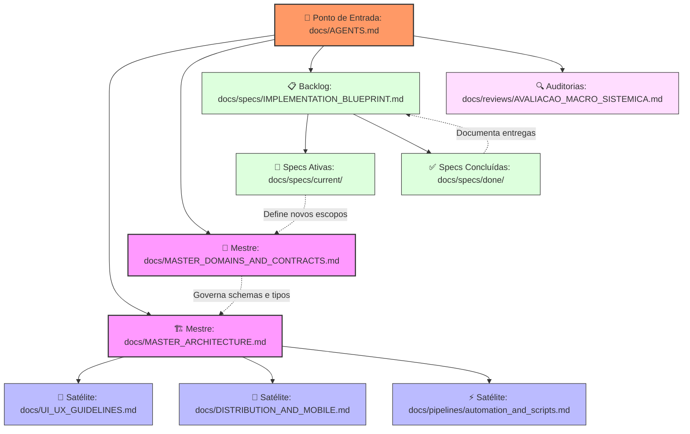

# 🗺️ AGENTS.md — Ponto de Entrada Contextual & Regras de IA (Bootstrap)

Este documento é a raiz do ecossistema e o principal ponto de entrada contextual para agentes cognitivos de IA e engenheiros de software. Projetado para otimização de busca, economia de tokens, navegação escalável e suporte a **Document-Driven Development (DDD)** e **Context-Driven Development (CDD)** por meio de links bidirecionais (compatíveis com editores de grafos como o **Obsidian**).

---

## 🌐 Grafo de Conhecimento e Index de Documentações (Geração 2.1)
Abaixo é apresentada a hierarquia estruturada e consolidada do nosso sistema documental. **Sempre comece consultando esta raiz antes de inspecionar ou alterar código.**


```mermaid
graph TD
    %% Ponto de Entrada
    AGENTS[🎯 Ponto de Entrada: docs/AGENTS.md] --> ARCH[🏗️ Mestre: docs/MASTER_ARCHITECTURE.md]
    AGENTS --> DOMAINS[🧠 Mestre: docs/MASTER_DOMAINS_AND_CONTRACTS.md]
    
    %% Satélites
    ARCH --> UIUX[🎨 Satélite: docs/UI_UX_GUIDELINES.md]
    ARCH --> MOBL[📱 Satélite: docs/DISTRIBUTION_AND_MOBILE.md]
    ARCH --> PIPE[⚡ Satélite: docs/pipelines/automation_and_scripts.md]
    
    %% Especificações e Backlog
    AGENTS --> BLUEPRINT[📋 Backlog: docs/specs/IMPLEMENTATION_BLUEPRINT.md]
    BLUEPRINT --> SPEC_CURR[🚀 Specs Ativas: docs/specs/current/]
    BLUEPRINT --> SPEC_DONE[✅ Specs Concluídas: docs/specs/done/]
    
    %% Revisões e Auditorias
    AGENTS --> REVIEWS[🔍 Auditorias: docs/reviews/AVALIACAO_MACRO_SISTEMICA.md]

    %% Relacionamentos de Contrato
    DOMAINS -.->|Governa schemas e tipos| ARCH
    SPEC_CURR -.->|Define novos escopos| DOMAINS
    SPEC_DONE -.->|Documenta entregas| BLUEPRINT

    classDef entry fill:#f96,stroke:#333,stroke-width:2px;
    classDef master fill:#f9f,stroke:#333,stroke-width:2px;
    classDef satellite fill:#bbf,stroke:#333,stroke-width:1px;
    classDef specs fill:#dfd,stroke:#333,stroke-width:1px;
    classDef review fill:#fdf,stroke:#333,stroke-width:1px;
    
    class AGENTS entry;
    class ARCH,DOMAINS master;
    class UIUX,MOBL,PIPE satellite;
    class BLUEPRINT,SPEC_CURR,SPEC_DONE specs;
    class REVIEWS review;
```

### 🗺️ Índice Geral e Grafo de Links Bidirecionais (Obsidian Friendly)

| Categoria | Documento | Caminho | Propósito Principal |
| :--- | :--- | :--- | :--- |
| **Ponto de Entrada** | [[AGENTS.md]] | `docs/AGENTS.md` | Bootstrap de IA, mapa mental do monorepo, regras operacionais e economia de tokens. |
| **Mestre** | [[MASTER_ARCHITECTURE.md]] | `docs/MASTER_ARCHITECTURE.md` | Especificação técnica do servidor BFF Fastify, Repositórios, Firestore e Gateway Serverless. |
| **Mestre** | [[MASTER_DOMAINS_AND_CONTRACTS.md]] | `docs/MASTER_DOMAINS_AND_CONTRACTS.md` | Fonte de verdade de dados (Zod, Types TS) unificada com regras de negócio e Skills. |
| **Satélite** | [[UI_UX_GUIDELINES.md]] | `docs/UI_UX_GUIDELINES.md` | Direcionamento estético iOS/Apple, motion/react e views reativas. |
| **Satélite** | [[DISTRIBUTION_AND_MOBILE.md]] | `docs/DISTRIBUTION_AND_MOBILE.md` | Portabilidade híbrida via CapacitorJS (Android e iOS). |
| **Satélite** | [[automation_and_scripts.md]] | `docs/pipelines/automation_and_scripts.md` | Infraestrutura de build, automação de variáveis de ambiente e hooks de git. |
| **Backlog** | [[IMPLEMENTATION_BLUEPRINT.md]] | `docs/specs/IMPLEMENTATION_BLUEPRINT.md` | Status das tarefas do backlog, pendências de roadmap e log de progresso. |
| Especificação | [[EVENT_DISCOVERY_ENGINE.md]] | `docs/specs/current/EVENT_DISCOVERY_ENGINE.md` | Arquitetura técnica e pipeline de fallback do motor de descoberta de novos eventos. |
| **Auditorias** | [[AVALIACAO_MACRO_SISTEMICA.md]] | `docs/reviews/AVALIACAO_MACRO_SISTEMICA.md` | Diagnóstico de maturidade (resiliência, erros, logs, performance e coverage). |

---

## 🛠️ Diretrizes de Desenvolvimento para Agentes de IA

Este ecossistema opera sob uma abordagem combinada de **Document-Driven Development (DDD)** e **Context-Driven Development (CDD)**.

### 📜 1. Document-Driven Development (DDD)
Antes de escrever uma única linha de código:
1. **Consulte a Especificação**: Procure na pasta `docs/specs/current/` se existe um documento de proposta para a funcionalidade atual.
2. **Atualize Conforme Implementa**: Ao completar uma tarefa, atualize o [[IMPLEMENTATION_BLUEPRINT.md]] e os documentos de especificação associados.
3. **Ciclo de Vida das Especificações (Specs Lifecycle)**:
   * **Nova Proposta/Ideia**: Criar especificação técnica detalhada na pasta `docs/specs/current/` (ex: `docs/specs/current/MINHA_SPEC.md`).
   * **Em Desenvolvimento**: A spec permanece em `current/` servindo de guia contextual absoluto para as ferramentas lógicas.
   * **Concluída/Entregue (Done)**: Mover o arquivo da spec para `docs/specs/done/` e atualizá-lo para registrar o estado de "Entrega Concluída" e critérios de aceitação validados.

### 🧠 2. Context-Driven Development (CDD)
Para economizar tokens e carregar apenas o contexto estritamente necessário para cada tarefa:
1. **Navegue pelo Grafo**: Siga os links Obsidian para carregar as dependências lógicas de contexto necessárias (ex: se for mexer em dados, leia [[MASTER_DOMAINS_AND_CONTRACTS.md]], se for mexer em rotas, consulte [[MASTER_ARCHITECTURE.md]]).
2. **Evite Leituras Globais Redundantes**: Não execute leituras repetitivas sobre arquivos que não foram alterados. Confie na memória cognitiva do ciclo de turnos corrente.
3. **Busca Cirúrgica**: Prefira comandos focados ou buscas específicas a varreduras globais cegas do repositório.

---

## 🧩 3. Visão Geral do Sistema e Bounded Contexts
A **Aimee** é uma assistente pessoal e planejadora orquestrada inteligente com múltiplos assistentes focados nos seguintes limites conceituais (Bounded Contexts):

1. **Aimee Core & Chat (`src/domain/intelligence` e `src/client/pages/ChatView.tsx`)**: Orquestração generativa em múltiplos canais, análise estendida de tokens de IA e auditoria de prompts.
2. **Finance & Wallet (`src/client/pages/FinanceView.tsx`)**: Gerenciamento de despesas, metas financeiras e relatórios estáticos estruturados.
3. **Shopping & Listas (`src/client/pages/ShoppingView.tsx`)**: Monitoramento de estoque pessoal, listas de compras dinâmicas compartilhadas.
4. **Calendar & Routines (`src/client/pages/RoutinesView.tsx`)**: Micro-gerenciamento de hábitos, alarmes, condicionais diárias integradas ao estilo de vida.
5. **Config & Identity (`src/client/pages/SettingsView.tsx` e `src/client/components/Header.tsx`)**: Painel de gerenciamento do ecossistema e identidade visual do perfil (preferências de avatar e do assistente).

---

## 📦 4. Estrutura do Monorepo e Responsabilidades
```bash
├── docs/                 # Documentação formal indexada em Obsidian e Markdown
│   ├── legacy/           # Histórico de transição e arquivos de arquiteturas antigas
│   ├── pipelines/        # Automação de builds e scripts de pipeline
│   ├── reviews/          # Relatórios e diagnósticos de auditoria do sistema
│   └── specs/            # Especificações ativas, rascunhos e log de entregas
│       ├── current/      # Especificações aprovadas em desenvolvimento ativo
│       └── done/         # Especificações totalmente implementadas e validadas
├── src/
│   ├── client/           # Front-end: SPA React, Vite, Tailwind CSS e motion
│   │   ├── components/   # Componentes modulares reutilizáveis (Header, AdminPanel, etc.)
│   │   ├── pages/        # Views principais ligadas às abas funcionais do sistema
│   │   ├── services/     # Serviços auxiliares de comunicação, push e notificações locais
│   │   └── hooks/        # State Hooks de autenticação e manipulação das ações da Aimee
│   ├── server/           # Back-end: Fastify, Firebase Admin, endpoints/rotas de API dedicadas
│   ├── domain/           # Camada de Domínio: Regras de negócio puras (validação, inteligência)
│   ├── infrastructure/   # Camada de Infraestrutura: Repositórios acoplados ao Firestore
│   ├── models/           # Schemas de validação determinística utilizando a biblioteca Zod 
│   └── types/            # Definições estritas de interfaces globais TypeScript
```

---

## 🚫 Anti-Patterns de IA
1. **Mocking ou Fake Data**: Nunca use dados estáticos fictícios ou simulação de sucesso para recursos contratados se você puder gerar uma real persistência de API baseada em Firestore em `src/infrastructure/repositories`.
2. **Overengineering**: Não crie padrões Enterprise imensos se a arquitetura puder ser resolvida com herança direta do `BaseRepository` e um modelo Zod simples.
3. **Reversão ou Perda de Contexto**: Nunca reverta alterações visuais requintadas feitas previamente pelo usuário sem uma confirmação de tradeoff. A integridade visual inspirada em interfaces minimalistas fluidas (Apple) é prioritária.

---

## 🎨 5. Convenções de Código e Arquitetura

* **Typography & Styling**: Uso exclusivo de Tailwind CSS (`@import "tailwindcss";` em `index.css`). Sem múltiplos arquivos CSS legados. Fontes geométricas limpas (Inter, Space Grotesk ou Fira Code/JetBrains Mono para visualizadores de status e dados).
* **Animations**: Animações suaves criadas obrigatoriamente com a biblioteca `motion/react` para mudanças de telas, abertura de modais e ações do assistente.
* **Zod Schemas**: Localizados exclusivamente em `src/models/index.ts` como fonte única da verdade para validação de dados e types (inferidos via z.infer) tanto no frontend quanto no backend.
* **Indentation & Code Standards**: Padrão de 2 espaços para indentação em arquivos JS, TS e TSX. Manter consistência estrita para conformidade com revisões de PR.
