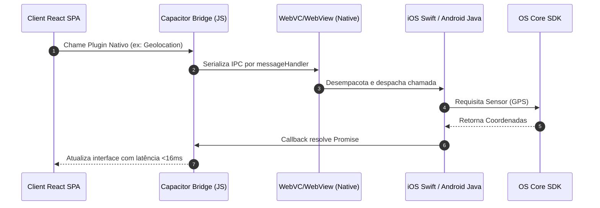

# 📱 DISTRIBUTION_AND_MOBILE.md — Empacotamento Híbrido, CapacitorJS e Estratégia de Lançamento (Geração 2.0)

Este documento dita e detalha a especificação técnica de portabilidade híbrida e o plano tático go-to-market do ecossistema **Aimee** para os canais de distribuição Web, Progressive Web App (PWA) e as lojas oficiais para dispositivos móveis Apple App Store e Google Play Store.

---

## 🏗️ 1. Portabilidade Híbrida via CapacitorJS

Aimee foi projetada sob uma arquitetura de Single Page Application (SPA) responsiva construída em React. Para viabilizar sua distribuição nos sistemas operacionais móveis **Google Android** e **Apple iOS** sem demandar a reescrita completa da base de códigos em linguagens nativas (Swift/Kotlin), é utilizada a ponte de abstração do **CapacitorJS**.



### 📦 1.1 Responsabilidade das Pastas e Descritores

*   **`capacitor.config.ts`**: Configuração central do ecossistema de compilação híbrida:
    *   `appId`: `'com.aimee.app'` (Bundle Identifier canônico para iOS e Application ID para Android).
    *   `appName`: `'Aimee'` (Nome de exibição nas telas de launcher dos displays).
    *   `webDir`: `'dist'` (Diretório do qual os assets estáticos transpilados do Vite serão copiados).
*   **`/android` (Projeto Gradle Nativo)**: Integra as dependências do Android SDK e define intents de deep-linking, metadados de capabilities e ciclos de execução via Activities.
*   **`/ios` (Projeto Xcode Nativo)**: Configura o ecossistema Swift com integração via CocoaPods / Swift Package Manager (SPM) sob o ciclo de vida regulador do UIKit.

### 🔄 1.2 Esteira de Build, Configuração e Sincronização Móvel

Sempre que modificações na interface do usuário exigirem testes em dispositivos ou emuladores físicos móveis:

1.  **Geração do Build Estático**: Executar `npm run build` para minificar os assets para a pasta `/dist`.
2.  **Sincronização com o Capacitor**: Executar `npx cap sync`. O Capacitor lê `/dist`, copia todos os arquivos estáticos para os diretórios internos dos wrappers móveis (`android/app/src/main/assets/public` e `ios/App/App/public`) e atualiza dependências locais de plugins do Node.
3.  **Boot de Ferramental Nativo**: Executar `npx cap open android` ou `npx cap open ios` para disparar os sistemas IDE oficiais (Android Studio e Xcode) e assinar/compilar os arquivos de entrega móveis (`.apk`, `.aab`, `.ipa`).

---

## 📢 2. Canais de Distribuição (Go-To-Market)

Para otimização de faturamento e validação ágil de hipóteses de negócios, o plano go-to-market estabelece duas frentes prioritárias de lançamento:

```
                  [Frente Principal: Web & PWA]
                    ✔ Custos operacionais baixos
                    ✔ Deploy instantâneo ininterrupto
                    ✔ Zero comissão de lojas
                               │
                               ▼
               [Frente Secundária: Lojas Móveis]
                    ✔ iOS & Android nativos via Capacitor
                    ✔ Acesso profundo a sensores de hardware
                    ✔ Modelo In-App Purchases (RevenueCat)
```

### 💻 2.1 Frente Principal: Progressive Web App (PWA)

O aplicativo funciona pelo navegador, permitindo a instalação nativa simplificada na tela inicial (A2HS - Add To Home Screen).

*   **Complexidade**: Baixa/Média.
*   **Progresso Concluído**: 85%.
*   **Etapas de Prédio e Ativação**:
    1.  *Manifest e Service Worker (`public/manifest.json` e `public/sw.js`)*: Garantir conformidade com ícones circulares maskable e cor de tema stand-alone (`#171717`).
    2.  *Certificados SSL exigidos*: Domínio customizado (`getaimee.com`) com HTTPS ativo obrigatório em servidores Cloud Run ou Firebase Hosting.
    3.  *Termos Legais e Políticas*: Publicação de documentos obrigatórios de privacidade para aceitação de domínios públicos de SSO do Google Workspace.

### 📱 2.2 Frente Secundária: Aplicativo Nativo (Lojas Oficiais)

Envelopamento do aplicativo com CapacitorJS para distribuição direta na App Store (Apple) e Google Play Store.

*   **Complexidade**: Alta (envolve burocracias de aprovação e adequações de hardware).
*   **Progresso Concluído**: 40%.
*   **Etapas de Prédio e Ativação**:
    1.  *Páginas de Permissão Nativa*: Criar rotinas no React que de forma modular consultem as capabilities dinamicamente usando a API de plugins Capacitor (`@capacitor/geolocation`, `@capacitor/push-notifications`).
    2.  *Controle de Safe-Area (UX Nativa)*: Tratamento de recortes físicos de tela (Notches e barras virtuais de navegação traseira do Android).
    3.  *In-App Purchases (IAP)*: Integração com bibliotecas especialistas como **RevenueCat** para controle de paywall e assinaturas pagas.
    4.  *Custos Burocráticos de Contas*: Apple Developer ($99/ano) e Google Play Console ($25 vitalício), certificações de segurança e revisão humana tática da Apple.

---

## 📈 3. Análise de Infraestrutura para Escala

A transição de um MVP centrado no cliente para um aplicativo robusto em nível de produção ("Production-Ready") exige o hardening de múltiplos canais operacionais:

### 🧩 3.1 Esteira e Ciclo de Vida do Software (CI/CD)
*   **Segregação Estrita de Ambientes**: Separação física estruturada no Firebase em pelo menos dois projetos estanques: `aimee-dev` e `aimee-prod` de forma a mitigar quebras em ambiente quente em produção.
*   **Automação Móvel**: Utilização do **Fastlane** integrado às Github Actions para automatizar a compilação paralela de binários nativos assinalados na esteira e descarregamento automático em rotas de testes no TestFlight e Google Play Console Tracks.

### 💰 3.2 Estratégias de Monetização, Gatekeeping e Custos de IA
Chamadas frequentes a LLMs custam caro e podem asfixiar economicamente o negócio se não forem geridas por travas rigorosas:
*   **Cotas de Uso por Usuário**: O `UsageRepository` calcula consumos, que devem ser interconectados com bloqueios baseados em cotas ativas (ex: "Sua cota de 20 Insights estruturados este mês culminou").
*   **Modelo de Negócio Sugerido**: Freemium Híbrido:
    *   *Plano Gratuito (Free)*: Registro financeiro manual clássico, timelines e regras de chatbot local/determinístico sem chamadas redundantes a APIs remotas de IA.
    *   *Plano Premium (Aimee Plus)*: Insights proativos comportamentais refinados (DeepSeek/Gemini Pro), leitura de fotos de recibos com OCR por IA para compras automáticas e sincronização contínua com calendário de IA.
*   **Gateway Stripe (Stripe Checkout)**: Uso do Stripe Checkout para transações realizadas em modo PWA. Para as lojas móveis, o intermédio das assinaturas é restrito ao RevenueCat para conformidade sob risco de banimento de aplicativo.

### ⚠️ 3.3 Segurança, Firewall (Rate Limit) e Conformidade LGPD
*   **Rate Limits Estritos no Backend BFF**: Configuração obrigatória de limites de tráfego (no Fastify via `@fastify/rate-limit`) nas rotas gerativas `/api/ai` atreladas ao JWT verificado para anular ataques de negação de serviço e esgotamento de cartões e faturamento em APIs.
*   **Cache Semântico local**: Armazenamento de respostas comuns sob hashes simples no lado do dispositivo, reduzindo a necessidade de acionar a inteligência remota para perguntas repetitivas do usuário.
*   **Privacidade LGPD / GDPR**: Explicitação clara de quais portais de nuvem processam os dados financeiros confidenciais inseridos nas conversas conversacionais do assistente nas políticas públicas do ecossistema.
