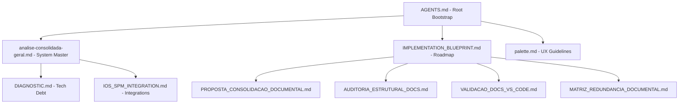

# Validação de Knowledge Graph Documental - Projeto Aimee

Este documento avalia a eficácia da estrutura documental sob a ótica de recuperação de contexto para agentes de IA (RAG e bootstrapping contextual).

## 1. Mapa do Knowledge Graph Atual (Conceitual)

## 2. Documentos Mestres Atuais
- `AGENTS.md`: Ponto de entrada obrigatório.
- `docs/analise-consolidada-geral.md`: Visão arquitetural integrada.

## 3. Documentos Satélite Atuais
- `docs/specs/IMPLEMENTATION_BLUEPRINT.md`: Status e progresso.
- `docs/specs/UI_UX_SPECIFICATION.md`: Detalhes visuais.
- `docs/decisions/LAUNCH_STRATEGY.md`: Estratégia de negócio.

## 4. Documentos Órfãos
- Os relatórios técnicos recentemente gerados (`AUDITORIA_ESTRUTURAL_DOCS.md`, `VALIDACAO_DOCS_VS_CODE.md`, `MATRIZ_REDUNDANCIA_DOCUMENTAL.md`) estão fracamente vinculados ao fluxo principal de leitura dos agentes.

## 5. Documentos Faltantes (Lacunas)
- **Intelligence Deep Dive**: Falta um documento que conecte o `IntentRouter` às ferramentas (Tools) e repositórios.
- **Event Discovery Specs**: Nova funcionalidade core sem especificação formal.

## 6. Pontos de Navegação Ruins
- **Caminho de Descoberta**: Um agente precisa ler o `AGENTS.md`, depois o `IMPLEMENTATION_BLUEPRINT.md` e depois os relatórios de auditoria para entender que existem drifts arquiteturais. O caminho é longo e desperdiça tokens.

## 7. Sugestões de Melhoria
- **Consolidação de Auditorias**: Unificar os 4 relatórios de metadados documentais em um único `docs/reviews/DOCS_HEALTH_REVIEW.md`.
- **Links Horizontais**: Adicionar links em `analise-consolidada-geral.md` apontando diretamente para as regras de implementação em `AGENTS.md`.

## 8. Score de Maturidade AI-native: **8.0/10**
- O sistema é altamente legível para IAs, mas a fragmentação recente de relatórios de auditoria diminui a eficiência de bootstrapping.

## 9. Riscos para Recuperação Contextual
- **Fragmentação**: O agente pode falhar em ler um relatório de auditoria específico e assumir que a documentação mestre (possivelmente desatualizada) é a verdade absoluta.
- **Excesso de Centralização**: `AGENTS.md` contém muitas regras de baixo nível que poderiam ser satélites, tornando o bootstrap pesado.

## 10. Sugestões de Links Cruzados
- Vincular `docs/architecture/DIAGNOSTIC.md` às seções correspondentes de "Drift" em `docs/VALIDACAO_DOCS_VS_CODE.md`.
- Vincular o Bounded Context de "Routine" no `AGENTS.md` ao documento de `Event Discovery` (quando criado).
