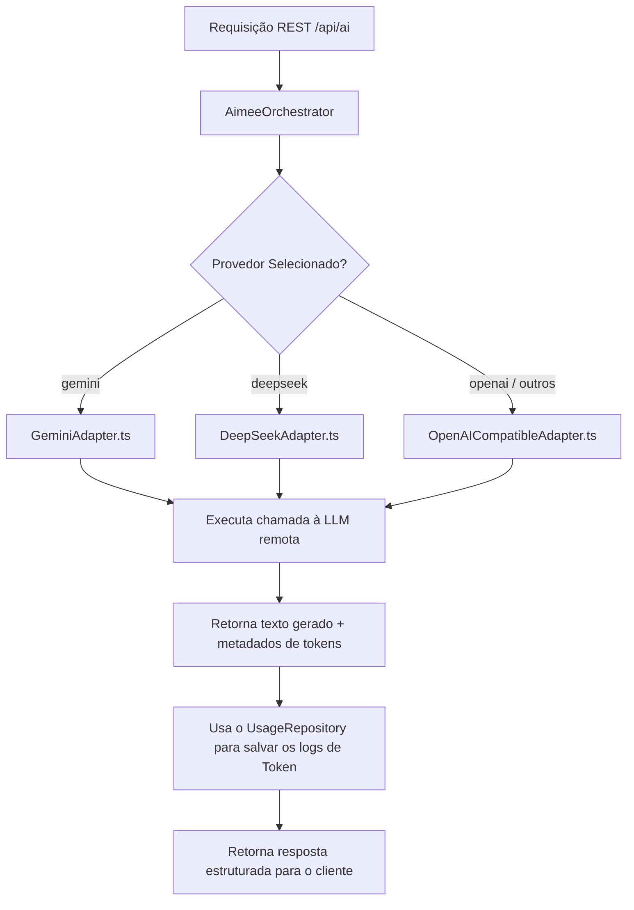
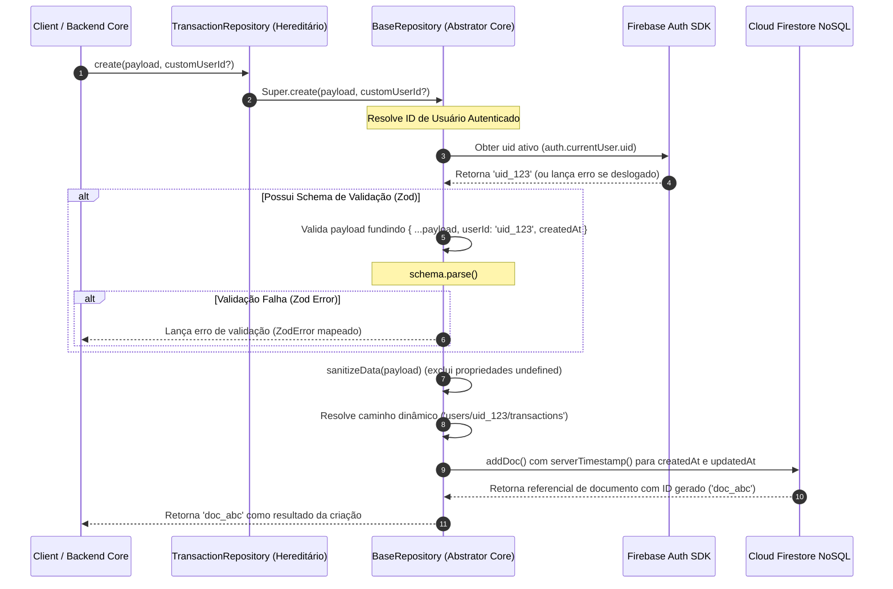

# 🏗️ MASTER_ARCHITECTURE.md — Servidor, Repositórios, Infraestrutura de Dados e Implantação (Geração 2.0)

Este documento consolidado serve como a especificação de engenharia definitiva do ecossistema backend e da infraestrutura de persistência de dados da **Aimee**. Ele governa a operação do servidor BFF (Backends for Frontends), o motor de banco de dados NoSQL, a injeção de dependências e a esteira de conteinerização.

---

## 🚀 1. Arquitetura Geral do Backend (O Servidor BFF)

O backend da Aimee é projetado como uma fortaleza isolada e segura (BFF) baseada no microframework **Fastify**. Ele blinda e gerencia de forma centralizada as chaves de API restritas e tokens de provedores externos (Google Workspace, OpenAI, DeepSeek, Firebase Admin), garantindo que credenciais faturadas permaneçam invisíveis ao cliente Web/Mobile.

### 📐 Estrutura de Diretórios Unificada
```bash
├── server.ts                    # Bootstrap do Fastify, Middlewares e integração com SPA Vite
├── api/
│   └── index.ts                # Handler de transposição para funções Serverless (Vercel Edge)
├── dist-server/
│   └── server.cjs               # Bundle autossuficiente compilado via esbuild
└── src/
    ├── server/
    │   ├── container.ts         # Registro do Container DI (Dependency Injection) via tsyringe
    │   ├── firebaseAdmin.ts     # Configuração e boot seguro do Firebase Admin SDK
    │   ├── googleAuth.ts        # Gerenciamento de credenciais e tokens do Google OAuth2
    │   ├── middlewares.ts       # Rate limiters, logs estruturados e sanitizações Zod
    │   ├── routes.ts            # Mapeador de endpoints REST de APIs
    │   ├── services/
    │   │   └── EmailService.ts  # Serviço de mensageria SMTP transacional
    │   └── llm/                 # Camada Hermética das Motores Gerativos de IA
    │       ├── ILLMProvider.ts  # Contrato/Interface canônica dos Provedores LLM
    │       ├── AimeeOrchestrator.ts # Controlador cerebral centralizador de processamento
    │       ├── GeminiAdapter.ts # Adapter oficial do SDK `@google/genai`
    │       ├── DeepSeekAdapter.ts # Adapter para modelos DeepSeek
    │       └── OpenAICompatibleAdapter.ts # Suporte para motores compatíveis OpenAI
    └── infrastructure/
        └── repositories/        # Classes de acesso a dados Firestore que estendem o BaseRepository
```

---

## 🧩 2. Inversão de Controle e Injeção de Dependência (DI)

Para garantir desacoplamento técnico, testabilidade e separação de interesses (SoC), o backend utiliza a biblioteca **tsyringe** (`reflect-metadata`) para realizar inversão de controle na pasta `/src/server/container.ts`.

*   **Singletons Gerenciados**: Serviços altamente concorrentes ou que exigem cache interno quente de conexões são cadastrados como instâncias únicas (`container.registerSingleton`):
    *   `AimeeOrchestrator`: Controlador intelectual dos provedores de IA.
    *   `EmailService`: Gerenciador smtp transacional.
    *   `GoogleAuth`: Centralizador de credenciais OAuth.
    *   `UsageRepository`: Repositório de registro de tokens.
*   **A Fratura Arquitetural Resolvida**: A UI do cliente no e-mail / browser interage via endpoints REST comuns, enquanto a resolução de classes no backend utiliza injeção automática de dependência via decoradores `@inject` e `@injectable`, minimizando instanciamentos imperativos repetitivos.

---

## 🔌 3. Contratos de APIs e Rotas REST (`/api/*`)

O barramento de rotas exposto pelo Fastify roteia o fluxo em portas seguras sob o prefixo `/api` em `/src/server/routes.ts`:

### A. AI Central Hub (`POST /api/ai`)
*   **Propósito**: Recebe os prompts de conversação natural do usuário.
*   **Validação**: Validação física de payload imposta via middleware com o esquema `aiRequestSchema`.
*   **Rate Limiting**: Bloqueio rígido de no máximo 10 requisições por minuto por endereço de IP para mitigar abusos financeiros de cota de inteligência.
*   **Carga Comum (JSON)**:
    ```json
    {
      "prompt": "Vendi o armário por R$ 350",
      "history": [],
      "persona": "funny",
      "provider": "gemini",
      "userId": "uid_777"
    }
    ```

### B. Conexão do Google OAuth e Callback (`GET /api/auth/google/url|callback`)
*   **Propósito**: Realiza a autenticação de contas do Google Workspace mantendo segredos ocultos:
    *   `/auth/google/url`: Retorna o endereço oficial de login solicitando offline access (`access_type: 'offline'`) e escopo de escrita em calendários (`calendar.events`).
    *   `/auth/google/callback`: Recebe o código temporário, troca-o por tokens ativos de acesso/refresh e despacha uma mensagem de janela protegida (`window.postMessage`) transferindo o JWT criptografado para o cliente SPA na interface Web de origem.

### C. Sincronização do Calendário (`POST|PUT|DELETE /api/calendar/events`)
*   **Propósito**: Manipulação de compromissos fisicamente integrados à Google Calendar:
    *   `POST /api/calendar/events`: Insere eventos.
    *   `PUT /api/calendar/events/:id`: Ajusta datas e descrições.
    *   `DELETE /api/calendar/events/:id`: Remove compromissos.

### D. Proxy de Geolocalização (`GET /api/location/nearby-markets`)
*   **Propósito**: Gateway seguro conectado à Google Places API. Recebe dados de latitude/longitude móveis, executa a busca de mercados e responde com insumos limpos.
*   **Segurança**: Impede o vazamento e exploração direta da chave de API do Google Maps, restrita no servidor backend (`config.google.mapsApiKey`).

---

## 🧠 4. Orquestração e Adapters Polimórficos de LLM

O `AimeeOrchestrator` centraliza e arbitra as decisões gerativas de IA de forma polimórfica, isolando as especificidades das APIs comerciais atrás da assinatura conceitual uniforme `ILLMProvider`:



*   **Padrão de Adapters**:
    *   `GeminiAdapter`: Conector oficial de ponta ao SDK `@google/genai` utilizando chaves nativas do sistema.
    *   `DeepSeekAdapter`: Motor focado em raciocínio, operando em modo JSON nativo configurado.
    *   `OpenAICompatibleAdapter`: Wrapper flexível para gpt-4o-mini ou qualquer outro gateway compatível.
*   **Gestão de Persona**: Mescla dinamicamente o prompt do usuário com diretrizes sistêmicas em `AimeePrompts.getSystemPrompt(persona)` para impor limites operacionais rígidos sobre tom, precisão factual e regras de concisão no retorno.

---

## 🗄️ 5. Infraestrutura de Persistência e Repositórios (Firestore)

Aimee adota a herança estrutural da classe genérica base **`BaseRepository`** localizada sob `/src/infrastructure/repositories` para prover agnosticismo de banco de dados à camada de domínio.

### 🛡️ Isolamento Físico de Dados (Tenant Isolation)

Para garantir segurança total de regras e privacidade em conformidade com as diretrizes da LGPD/GDPR, os dados estão distribuídos em duas categorias geográficas de caminhos no Cloud Firestore:

1.  **Subcoleções de Usuário (User Subcollections)**:
    *   *Mapeamento*: `users/{userId}/transactions`, `users/{userId}/tasks`, `users/{userId}/shopping_items`.
    *   *Propósito*: Garante isolamento estrito. Se o usuário deletar sua conta, uma única chamada recursiva varre e expurga os dados de forma definitiva utilizando a árvore aninhada do `userId`.
2.  **Coleções Globais / Compartilhadas (Global Collections)**:
    *   *Mapeamento*: `users` (Perfis estruturados base), `monitor_events` (Cache centralizado de eventos minerados no Brasil).



---

## 📑 6. Classe Base e Métodos Genéricos (`BaseRepository.ts`)

A assinatura abstrata unifica tratamentos de concorrência, higienização de nulos e carimbos de data/hora (`serverTimestamp()`):

*   **`create(data, customUserId?)`**: Mapeia e resolve caminhos dinâmicos no Firestore, removendo variáveis declaradas com valor `undefined` (incompatíveis com gravações estritas do Firestore) através do helper `sanitizeData()`.
*   **`update(id, data, customUserId?)`**: Modifica parcialmente atributos do nó de dados, gerando carimbos do updatedAt e validando de forma fragmentada no Zod através do construtor `.partial()`.
*   **`delete(id, customUserId?)`**: Destrói fisicamente o nó associado.
*   **`getById(id, customUserId?)`**: Extrai dados hidratando o objeto com o identificador persistente `id` no objeto final.
*   **`list(constraints[], customUserId?)`**: Mapeia consultas adicionando as restrições canônicas de escaneamento (`where()`, `orderBy()`, `limit()`).

### Tabela de Repositórios Especializados

| Repositório Classe | Caminho do Firestore (Collection Path) | Schema de Validação | Finalidade e Particularidades |
| :--- | :--- | :--- | :--- |
| **`TaskRepository`** | `users/{userId}/tasks` | `HouseholdTaskSchema` | Controla hábitats, check-ins e recorrências de rotinas. |
| **`TransactionRepository`** | `users/{userId}/transactions` | `TransactionSchema` | Orquestrador de fluxo de caixa familiar (receitas e despesas). |
| **`ShoppingRepository`** | `users/{userId}/shopping_items` | `ShoppingItemSchema` | Consolida despensas e listas inteligentes de compras. |
| **`ProfileRepository`** | `users` (Global) | `UserProfileSchema` | Perfis gerais de usuários, com suporte customizado do Google OAuth. |
| **`MonitorEventRepository`** | `monitor_events` (Global) | `MonitorEventSchema` | Cache global de eventos colhidos. Gravações transacionais em lote. |
| **`UsageRepository`** | `users/{userId}/usage` | `LLMUsageSchema` | Controle cumulativo e auditoria de faturamento de IA. |

---

## ☁️ 7. Implantação Híbrida e Gateway Serverless

O backend em monorepo da Aimee suporta dois fluxos operacionais nativos em produção para garantir máxima versatilidade e resiliência financeira de hospedagem:

### A. Fluxo Serverless Completo (`/api/index.ts` via Vercel Edge)
Para diminuir custos de infraestrutura stateful ininterrupta, as requisições principais podem ser executadas como funções Serverless de Borda:
*   **Lazy Loading de Módulos (Bootstrap Tardio)**: Para neutralizar o atraso inicial de carregamento (Cold Start), o handler na borda expõe os pacotes canônicos sem invocar o ecossistema Firebase Admin ou IA logo de início. Na recepção da primeira chamada, o validador confere uma instância na memória quente. Caso resida vazia, invoca de forma dinâmica assíncrona o loop `initServer()`, injetando registros do container, rotas e extensions de segurança (`@fastify/cors`, `@fastify/middie`).

### B. Fluxo de Container Dedicado Estado-Fixco (`/dist-server/server.cjs` via Cloud Run / Docker)
Para cenários de alto tráfego concorrente e sessões persistentes, o projeto é empacotado como um motor stateful contínuo:
*   **Esteira de Build via esbuild**: O script de build transpila o servidor TypeScript compilando-o em um arquivo autossuficiente único em JavaScript CommonJS (`/dist-server/server.cjs`).
*   **Vantagem Crítica**: Ao concatenar módulos locais no bundle síncrono resolve-se o problema de importação dinâmica do ecossistema Node ES Modules, anulando dependências de descarregamento no container e maximizando a velocidade de boot na porta dedicada (`3000`).

---

## ⚠️ 8. Riscos Técnicos e Salvaguardas

1.  **Latência de Cold Start no Serverless**: Chamadas interrompidas por longos intervalos de desuso sofrem atraso no primeiro bootstrap de container devido ao tempo de carga modular.
    *   *Mitigação*: Implementação de disparos cron automáticos simplificados (Heartbeat/Keep-Alive) que acionam um endpoint vazio de integridade (`GET /api/health`) a cada 10 minutos para garantir que a memória permaneça quente.
2.  **O Limite de 500 Escritas em Lote (Firestore Batches)**: Tentativas de gravar eventos minerados massivos que extrapolem o limite absoluto do Firestore SDK geram falhas fatais em massa.
    *   *Mitigação*: O motor em `MonitorEventRepository` fraciona o agrupamento original em sub-chamadas dinâmicas restritas a no máximo 100 itens simultâneos de gravação.
3.  **Incompatibilidade de Ambiente do Firebase Admin no Backend**: Consultas sistêmicas do Fastify invocando serviços NoSQL sem credenciais ativas causam loops em blocos catch e transações congeladas.
    *   *Mitigação*: Uso mandatório de `firebase-admin` na injeção de conexões do servidor backend, contornando restrições básicas aplicadas apenas ao Firebase Web Client.
