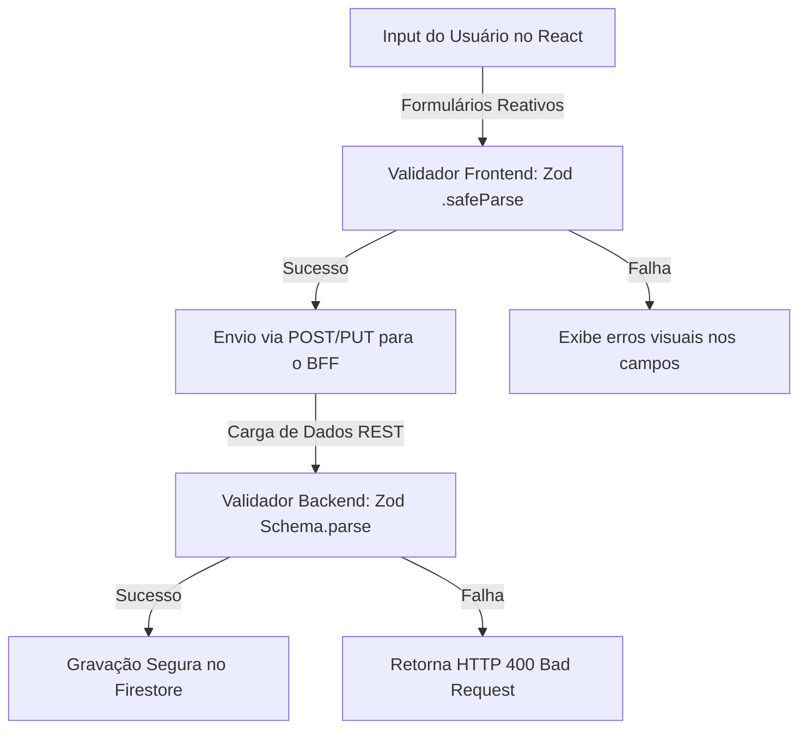
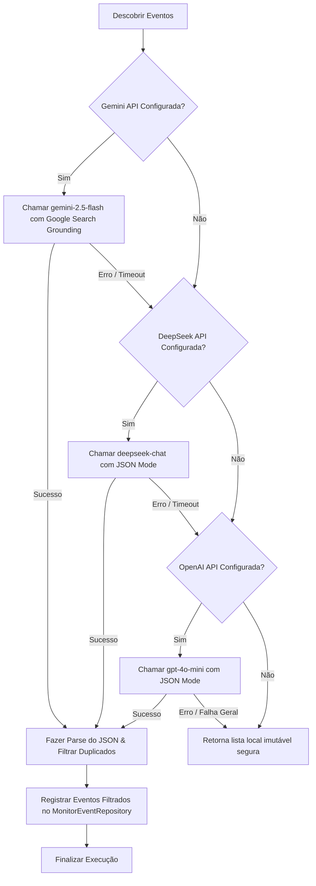

# 🧠 MASTER_DOMAINS_AND_CONTRACTS.md — Regras de Negócio, Modelos de Dados, Validações e Inteligência (Geração 2.0)

Este documento consolidado serve como a especificação conceitual de domínio e validação lógica do ecossistema **Aimee**. Projetado sob princípios de Clean Architecture, este arquivo rege as regras de negócio puras, a modelagem determinística de dados e o motor de inteligência por trás dos Bounded Contexts.

---

## 🗺️ 1. O Domínio e seus Bounded Contexts

O domínio da Aimee está encapsulado sob as regras contidas em `/src/domain`. Ele é independente de frameworks visuais ou detalhes de persistência fisicamente acoplados de banco de dados, atuando como o núcleo intelectual absoluto do ecossistema familiar.

O sistema é segmentado em cinco contextos bem definidos:

1.  **Aimee Core & Chat**: Orquestração generativa multicanal, análise léxica e auditoria de prompts organizados em `/src/domain/intelligence`.
2.  **Finance & Wallet (Finanças)**: Controle de fluxo de despesas familiares, balanços monetários periódicos e geração de metas financeiras preventivas.
3.  **Shopping & Storage (Abastecimento)**: Monitoramento de estoques em despensas domésticas e controle colaborativo de listas dinâmicas de supermercado.
4.  **Calendar & Routines (Rotinas)**: Microgerenciamento de hábitos saudáveis, escalas domésticas e eventos do Google Agenda.
5.  **Config & Identity (Configuração)**: Gerenciador de espaços dinâmicos familiares e preferências visuais dos perfis integrados.

---

## 📐 2. Modelagem Determinística de Dados (Zod Schemas)

Para robustez no processamento e resiliência contra corrupção residual de dados (Data Corruption), Aimee adota as validações em tempo de execução baseadas na biblioteca **Zod** (`/src/models/index.ts` e `/src/types/schemas.ts`).

Seguindo o padrão de projeto **Single Source of Truth (SSOT)**, as tipagens estáticas em TypeScript são inferidas de forma matemática a partir dos declaradores funcionais do Zod, eliminando duplicações redundantes de código:

$$\text{TypeScript Types} \equiv \text{z.infer}\langle\text{typeof ZodSchema}\rangle$$



### 📌 Coleção de Schemas Canônicos

#### A. Perfil de Usuário (`UserProfileSchema`)
Controla o perfil ativo e mecânicas de gamificação no lar:
*   `uid`: String UUID exclusiva emitida pelo Firebase Authentication.
*   `displayName` / `nickname`: Nome real e apelido de personalização conversacional para a IA.
*   `selectedPersona`: Persona selecionada de tom de voz da IA (`funny`, `analytical`, `frugal`).
*   `gamification`: Sub-objeto com atributos de `points` (XP), `level`, e `badges` (conquistas atingidas).
*   `status`: Máquina de estado do perfil (`pending`, `approved`, `rejected`, `blocked`).

#### B. Transações Financeiras (`TransactionSchema`)
Governa a fluxo contábil do lar:
*   `amount`: Valor monetário decimal (estritamente positivo, default `0`).
*   `type`: Fluxo de dinheiro da transação (`income` para receitas ou `expense` para despesas).
*   `category`: Segmentação de gastos (ex: `supermarket`, `utilities`, `transport`, `entertainment`).
*   `date`: Representação higienizada de data validada se é parseável por data real no Javascript.

#### C. Itens de Abastecimento (`ShoppingItemSchema`)
Estrutura a despensa dinâmica e rotinas de compras do lar:
*   `name` / `quantity`: Identificador do item e número volumétrico (mínimo `0`).
*   `purchased`: Flag booleano de indicação de compra em mercado.
*   `urgency`: Critério de prioridade de aquisição (`low`, `medium`, `high`).
*   `isStock` / `frequency`: Flag definidor se integra o inventário permanente e ciclos de reabastecimento.
*   `latitude` / `longitude` / `locationName`: Metadados de georreferenciamento para alertas físicos de proximidade (Geofence).

#### D. Tarefas e Hábitos Domésticos (`HouseholdTaskSchema`)
Organiza tarefas colaborativas e eventos de rotina:
*   `category`: Seção de responsabilidade (`cleaning`, `maintenance`, `errand`, `other`).
*   `status`: Status do cumprimento da tarefa (`todo` ou `done`).
*   `time`: Validador de hora 24 militar rigidamente coberto por Expressão Regular:
    ```typescript
    const hhMmRegex = /^([01]\d|2[0-3]):?([0-5]\d)$/;
    ```
*   `recurrence`: Submodelo `TaskRecurrenceSchema` que parametriza intervalos (`daily`, `weekly`, `monthly`, `annual`) junto com dias úteis de aceitação (`daysOfWeek`).

#### E. Auditoria de Gasto de Redundância (`LLMUsageSchema`)
Rastreia a auditoria de faturamento de tokens gerados por rotas inteligentes:
*   `model`: Versão exata da rede neural operada (ex: `gemini-1.5-flash`).
*   `promptTokens` / `completionTokens` / `totalTokens`: Inteiros consolidados indicadores de consumo de dados para controle financeiro dos custos de IA do app.

---

## 🛠️ 3. Camada de Habilidades Especializadas (Domain Skills)

As **Skills** localizadas sob `/src/domain/skills` atuam como orquestradores estruturais de inteligência. Elas agregam, validam e enriquecem dados transacionais antes de qualquer contato físico com a camada de banco de dados, agindo como portas lógicas de processamento baseadas em regras determinísticas e gerativas de negócio.

### 📈 A. Habilidade Financeira (`FinanceSkill`)
Orquestra o balanço contábil em tempo real do ecossistema familiar:
*   **Agrupamento Contábil (`getSummary`)**: Varre logs históricos do lar para calcular o fluxo monetário síncrono cruzando dados de receita e despesas:
    $$\text{Saldo Geral} = \sum(\text{Amount}_{\text{Income}}) - \sum(\text{Amount}_{\text{Expense}})$$
*   **Category Breakdown**: Calcula percentagens exatas de consumo em tempo de execução para avaliar vazamento de fundos.
*   **Taxa de Poupança (`getSavingsRate`)**: Computa o nível de acúmulo financeiro familiar:
    $$\text{Savings Rate (\%)} = \left( \frac{\sum\text{Income} - \sum\text{Expense}}{\sum\text{Income}} \right) \times 100$$

### 🛒 B. Habilidade de Abastecimento (`ShoppingSkill`)
Gerencia de forma proativa o provisionamento de insumos alimentares e de higiene da casa:
*   **Deduplicação Proativa**: Ao receber inserções de itens que já estejam listados no mercado como pendentes, a habilidade incrementa o montante original ao invés de duplicar registros na base física Firestore.
*   **Finalização de Carrinho (`finalizeShopping`)**: No encerramento do "Modo Compra", ela desloca todos os records recém-comprados de "Pendentes na Lista" para "Em Estoque na Despensa" e calibra os tempos de guarda do `lastPurchasedAt` de forma transacional.

### 📅 C. Habilidade de Rotina (`RoutineSkill`)
Governa o sequenciamento de eventos e tarefas colaborativas entre familiares:
*   **Motor de Expansão de Recorrências**: Ao receber uma tarefa recorrente, a Skill aciona métodos de projeção cronológica (`generateRecurrenceInstances`) para expandir e projetar novos records automáticos no banco ao longo do horizonte temporal definido.
*   **Exclusão Bidirecional Inteligente**: Permite que ao alterar ou deletar uma instância repetitiva, o usuário opte por modificar somente a instância atual (`single`), as sucessoras (`following`), ou a cadeia total de registros históricos (`all`).

### 🔍 D. Varredura e Descoberta de Eventos (`EventDiscoverySkill`)
Executa auditoria cibernética ampla sobre eventos profissionais e culturais de interesse do usuário nas capitais do Brasil. Implementa um pipeline de robustez baseado em **Multi-Model Fallback com Grounding e Rastreabilidade de Tokens**:



*   **Google Search Tool Grounding**: Utiliza recursos em tempo real de pesquisa integrados à API Gemini para pesquisar fontes reais (Sympla, Eventbrite), neutralizando alucinações de datas e preços.
*   **Faturamento Rastreável de Tokens**: Toda chamada captura o objeto `usageMetadata` do adapter correspondente e salva de maneira assíncrona o log no `UsageRepository` para controle de custos de borda do monorepo.
*   **Deduplicação por Hash**: Para evitar redundâncias de banco que oneram leituras do Firestore, a Skill gera hashes MD5 do título, local e data dos eventos descobertos, usando-os como IDs físicos na coleção `monitor_events`. Registros idênticos são ignorados de forma síncrona pela base na escrita (`saveBatch()`).

---

## 🔮 4. O Motor de Insights e Confiança (`InsightEngine`)

O **`InsightEngine`** (`/src/domain/intelligence/InsightEngine.ts`) utiliza modelos matemáticos aplicados em memória de forma determinística para inferir fatos comportamentais sobre o usuário de forma autônoma, minimizando requisições constantes de inteligência artificial generativa externa.

### 🛡️ Níveis de Confiança de Dados (Confidence Matrix)

As inferências geradas são qualificadas em dois quadrantes claros:
*   🟢 **`confirmed` (Confirmado)**: Alertas analíticos matematicamente exatos derivados do banco de dados do próprio usuário (ex: Alerta de Tarefa com prazo estourado, Identificação da categoria financeira principal que rompeu o orçamento, Taxa de poupança abaixo de 10%).
*   🟡 **`inferred` (Inferido / Preditivo)**: Recomendações em estágio de previsão estatística derivadas de padrões matemáticos temporais em comportamento de uso.

### 📊 Modelo Matemático Preditivo de Consumo do Estoque (Despensa)

O `InsightEngine` monitora as datas de compra consecutivas de itens permanentes do lar para prever e alertar o esgotamento físico de itens de despensa (por exemplo: café, leite ou sabão) antes que eles acabem.

Dada uma coleção de compras anteriores para um mesmo item ordenadas por data, denote as datas por:
$$D = \{D_1, D_2, \dots, D_N\}$$

Calculamos o intervalo de dias entre consumos sucessivos. O intervalo médio estimado $\Delta T_{\text{média}}$ é dado por:
$$\Delta T_{\text{média}} = \frac{1}{N-1}\sum_{i=1}^{N-1} (D_{i} - D_{i+1})$$

Sendo $D_{\text{recente}}$ a data de aquisição do item mais recente em estoque, o motor realiza a varredura e gera um alerta preditivo em cache assim que o tempo em curso (tempo corrente $T_{\text{hoje}}$) cruza o limite da janela de depleção segura:

$$T_{\text{hoje}} - D_{\text{recente}} \geq (\Delta T_{\text{média}} - 1)$$

Ao cruzar essa margem protetiva, o `InsightEngine` cria um alerta em nível de confiança `inferred` e sugere de forma automatizada à listagem de compras pendentes a re-inserção tátil do mantimento sob urgência média, evitando a interrupção de abastecimento na cozinha dos usuários.

---

## ⚡ 5. Serviço de Validação Central (`ValidationService`)

O **`ValidationService`** (`/src/domain/services/ValidationService.ts`) fornece uma barreira de proteção no sistema convertendo resultados de validações funcionais em feedbacks polidos de mensagens de erro amigáveis para a interface do usuário, assegurando que nenhum dado corrompido ou mal formado transite para a camada do banco de dados:

```typescript
// Validação e higienização tática de payloads de transação
public validateTransaction(data: unknown): string | null {
  const result = TransactionSchema.safeParse(data);
  if (!result.success) {
    return result.error.errors.map(err => `${err.path.join('.')}: ${err.message}`).join(', ');
  }
  return null;
}
```
