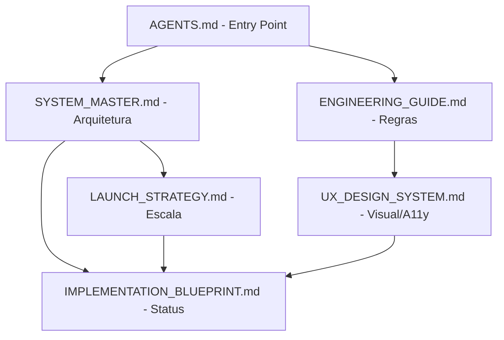

# Proposta de Consolidação Documental - Projeto Aimee

Este documento apresenta a estratégia para unificar e otimizar a base de conhecimento do projeto, eliminando redundâncias e resolvendo conflitos, enquanto preserva a rastreabilidade histórica e a memória técnica necessária para agentes de IA e engenheiros humanos.

## 1. Diagnóstico de Redundâncias e Overlaps

### 1.1 Overlaps Críticos
- **Arquitetura (High-Level)**: `docs/analise-consolidada-geral.md` e `docs/architecture/DIAGNOSTIC.md` compartilham 70% de conteúdo sobre o padrão BFF, Clean Architecture e Repository Pattern.
- **Convenções de UI/UX**: `docs/specs/UI_UX_SPECIFICATION.md` e `docs/conventions/palette.md` sobrepõem-se em diretrizes de acessibilidade (ARIA labels) e princípios de design "Apple-style".
- **Roadmap e Progresso**: `docs/specs/IMPLEMENTATION_BLUEPRINT.md` contém logs de progresso que colidem cronologicamente com as observações de "Limpeza Técnica" em `docs/architecture/DIAGNOSTIC.md`.

### 1.2 Conflitos Identificados
- **Maturidade Técnica**: O `IMPLEMENTATION_BLUEPRINT.md` foca em entregas concluídas com tom otimista, enquanto o `DIAGNOSTIC.md` aponta "vulnerabilidades estruturais" e "dicotomias de orquestração" nos mesmos módulos.
- **Localização de Schemas**: Documentos divergem sobre a "Fonte da Verdade" para Schemas (Zod vs Interfaces TS), embora a memória recente aponte para `src/models/index.ts`.

---

## 2. Estrutura de Conhecimento Proposta (Master/Satellite)

### 2.1 Documentos Mestres (Core)
Estes documentos são as fontes definitivas de verdade e devem ser consultados primeiro.
1. **`SYSTEM_MASTER.md` (Novo)**: Consolida Visão Geral, Responsabilidades e Fluxo Operacional (Merge de `analise-consolidada-geral.md` + `DIAGNOSTIC.md` Seção A/B).
2. **`ENGINEERING_GUIDE.md` (Novo)**: Consolida Regras de Implementação, Anti-patterns e Limpeza Técnica (Merge de `AGENTS.md` + `DIAGNOSTIC.md` Seção C).
3. **`UX_DESIGN_SYSTEM.md` (Novo)**: Consolida Mood, Componentes e Acessibilidade (Merge de `UI_UX_SPECIFICATION.md` + `palette.md`).

### 2.2 Documentos Satélite (Contextuais)
1. **`IMPLEMENTATION_BLUEPRINT.md`**: Mantido exclusivamente para Roadmap, Status de Etapas e Logs de Progresso.
2. **`LAUNCH_STRATEGY.md`**: Mantido para decisões de GTM e escala.
3. **`IOS_SPM_INTEGRATION.md`**: Mantido como documentação técnica de nicho.

### 2.3 Knowledge Graph Documental

---

## 3. Matriz de Impacto e Plano de Consolidação

| Documento Original | Ação | Documento Alvo | Impacto | Risco |
| :--- | :--- | :--- | :--- | :--- |
| `analise-consolidada-geral.md` | Merge Total | `SYSTEM_MASTER.md` | Alto | Perda de clareza no fluxo operacional. |
| `DIAGNOSTIC.md` | Fracionar | `SYSTEM_MASTER.md` (Arq) & `ENGINEERING_GUIDE.md` (Técnico) | Alto | Perda de rastreabilidade de dívidas técnicas. |
| `palette.md` | Merge | `UX_DESIGN_SYSTEM.md` | Médio | Perda de aprendizados específicos de micro-UX. |
| `UI_UX_SPECIFICATION.md` | Merge | `UX_DESIGN_SYSTEM.md` | Médio | Diluição de especificações de wireframe. |

### Sugestões de Merge Incremental (Passo a Passo)
1. **Fase 1**: Criar `SYSTEM_MASTER.md` injetando a Seção 2 e 3 de `analise-consolidada-geral.md` e a Seção A de `DIAGNOSTIC.md`.
2. **Fase 2**: Criar `ENGINEERING_GUIDE.md` movendo a Seção C e D de `DIAGNOSTIC.md` e as regras de implementação de `AGENTS.md`.
3. **Fase 3**: Criar `UX_DESIGN_SYSTEM.md` unificando a seção de Acessibilidade de `palette.md` com a Seção 4 de `UI_UX_SPECIFICATION.md`.
4. **Fase 4**: Mover originais consolidados para uma pasta `docs/archive/` (não apagar) para manter rastreabilidade histórica.

---

## 4. Riscos e Mitigação
- **Risco**: Perda de detalhes críticos em resumos excessivos.
  - *Mitigação*: Usar técnica de "Documentação em Camadas" - manter detalhes técnicos profundos em seções expansíveis ou anexos dentro dos documentos mestres.
- **Risco**: Quebra de cross-links entre documentos.
  - *Mitigação*: Atualizar o `Index de Documentações` no `AGENTS.md` imediatamente após cada fase de consolidação.
- **Risco**: Obsolecência rápida de documentos mestres.
  - *Mitigação*: Delegar a atualização do `SYSTEM_MASTER.md` como passo obrigatório no fluxo de PRs que alteram a infraestrutura core.

---
**Status da Proposta**: Pendente de Revisão e Aprovação.
**Ação Recomendada**: Iniciar Fase 1 de consolidação após validação do Arquiteto.
