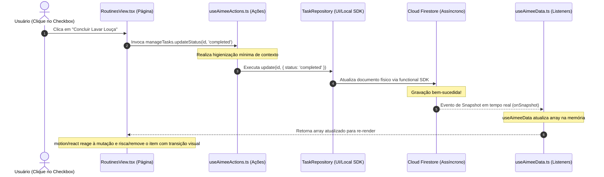

# 🎨 UI_UX_GUIDELINES.md — Manual de Identidade Visual, React Client SPA e Motion UX (Geração 2.0)

Este documento consolidado serve como a diretriz definitiva de design, engenharia de front-end e experiência de uso do ecossistema de cliente da **Aimee**. Ele unifica a filosofia estética inspirada no iOS/Apple Music com as decisões estruturais de desenvolvimento da Single Page Application (SPA).

---

## 🎵 1. Filosofia de Design e Direcionamento Estético

A interface da Aimee é projetada para ser tátil, fluida e visualmente refinada, oferecendo uma experiência premium semelhante aos aplicativos de ponta do mercado de bens de consumo digital (Apple Music, ChatGPT Plus e Copilot Pro).

### 🎨 Pilares Estéticos de Elite

1.  **A Referência iOS / Apple Music**:
    *   **Glassmorphism (Efeito Vidro)**: Uso extensivo de superfícies translúcidas com desfoque de fundo combinado com bordas brilhantes sutis:
        ```css
        background: rgba(23, 23, 23, 0.7);
        backdrop-filter: blur(20px);
        border: 1px solid rgba(255, 255, 255, 0.08);
        ```
    *   **Bordas Arredondadas Robustas**: Cards e containers modulares possuem cantos com raio generoso (24px+ ou `rounded-3xl` no Tailwind CSS) para criar uma sensação acolhedora e tátil.
    *   **Tipografia Clara e Geométrica Pairing**:
        *   *Headings/Títulos*: **Space Grotesk** ou **Outfit** para passagens display de alta performance.
        *   *Corpo de Texto e UI*: **Inter** para leitura limpa com alto contraste de contraste.
        *   *Metadados/Métricas*: **Fira Code** ou **JetBrains Mono** para visualização de números, tokens e moedas.
2.  **Harmonia Cromática**:
    *   A interface padrão é desenhada sobre um fundo neutro minimalista (**Cosmic Slate Theme**): tons profundos de grafite e carvão (`#121212`, `#171717`) compensados por cinzas suaves de contraste alto e acentos de cor vibrantes (neon ou violeta) para botões de ação críticos.
3.  **Arquitetura de Densidade e Respiro (Negative Space)**:
    *   Evita-se a compactação fria de elementos. Há generosidade em preenchimentos (paddings) e espaçamentos (margins) para permitir que a interface "respire", reduzindo o cansaço cognitivo.

---

## 📱 2. Estrutura da Single Page Application (Vite + React)

O front-end reside em `/src/client` e adota um fluxo de dados unidirecional estrito baseado em ganchos adaptados para o Firebase.

```
src/client/
├── App.tsx                      # Bootstrap de navegação, roteador e ciclo de vida global de autenticação
├── main.tsx                     # Ponto de entrada React do DOM
├── index.css                    # Injetor global de Tailwind CSS e fontes do Google
├── components/                  # UI modulares purificadas (Avatar, Visualizer, Toasts)
├── pages/                       # Telas e Abas físicas do core do negócio
└── hooks/                       # Ganchos de inteligência e controle local de estado
```

### 🔁 Fluxo de Estado Unidirecional (One-Way Data Flow)

Qualquer mutação de controle visual na tela segue a esteira mecânica abaixo para garantir consistência e evitar re-renders cíclicos:



---

## 🛠️ 3. Portfólio de Abas e Telas (Views)

A navegação centralizada em `App.tsx` chaveia o usuário entre cinco abas dinâmicas, persistindo a página ativa no `localStorage` sob a chave correspondente:

### A. Central de Conversação (`ChatView.tsx`)
É o coração operacional do ecossistema. Funciona como portal de voz e prompts:
*   **AimeeAvatar**: Componente lúdico renderizado em tempo real. Pisca, sorri e se move em loops fluidos de acordo com o status atual do processador (`thinking`, `listening`, `idle`), dando um feedback semântico dinâmico e amigável.
*   **AudioVisualizer**: Canvas síncrono conectado à Web Audio API que renderiza formas de onda de áudio estilizadas em tempo real enquanto o usuário vocaliza comandos pelo microfone.
*   **ReactiveFeed**: Feed otimizado de mensagens instantâneas com rolagem ancorada e renderização de blocos markdown amigáveis.

### B. Painel Econômico (`FinanceView.tsx`)
Visão analítica de saúde orçamentária do lar:
*   **Gráficos Recharts**: Visualizadores geométricos limpos (splines circulares e colunas sem gradeamento excessivo) que expõem faturamento, receitas e categorias de compra dominantes.
*   **Interactive Goals**: Réguas e barras de progresso táteis que registram metas de salvamento de recursos ou limites de despesas do casal.

### C. Abastecimento e Despensa (`ShoppingView.tsx`)
Gerenciamento de estoques alimentares e de higiene familiares:
*   **Checklist Interativo**: Suporte a gestos físicos táteis (Swipe-to-Delete) e categorização instantânea por prateleiras de mercado (Limpeza, Carnes, Padaria, Hortifruti).
*   **Modo Mercado**: Layout de alta acessibilidade com botões robustos de conclusão rápida e tipografia alargada para uso confortável enquanto o usuário empurra carrinhos no estabelecimento real.

### D. Agenda Integrada e Timeline (`RoutinesView.tsx`)
Cronologia de eventos do lar sincronizados com o Google Agenda externo:
*   **Weekly Slider**: Componente deslizante horizontal tátil que permite navegar pelos dias da semana com toques rápidos operados por apenas um dedo.
*   **Gamified Tasks Grid**: Visualizador de pendências domésticas agregadas sob trilhas de streaks e recompensas de XP para engajar membros da família em rotinas do lar.

### E. Painel Administrativo de Espaços (`SettingsView.tsx`)
Seção de controle de privacidade, login e alternância nativa de domicílios compartilhados.

---

## 🍿 4. O Coração de Movimentos e Transições (Motion UX)

Para evitar intercorrências visuais abrruptas e saltos de elementos, Aimee integra a biblioteca **`motion/react`** de forma sistêmica.

### 🎚️ Transição de Slider de Abas
O chaveamento entre as abas é envolvido por amortecedores baseados na física real, mimetizando o deslize biomecânico bidirecional clássico do iOS:

```typescript
export const slideVariants = {
  enter: (direction: number) => ({
    opacity: 0,
    x: direction > 0 ? 120 : -120,
    scale: 0.98
  }),
  center: {
    opacity: 1,
    x: 0,
    scale: 1,
    transition: {
      duration: 0.25,
      ease: [0.16, 1, 0.3, 1] // Amortecimento Cúbico Apple Fluid
    }
  },
  exit: (direction: number) => ({
    opacity: 0,
    x: direction < 0 ? 120 : -120,
    scale: 0.98,
    transition: {
      duration: 0.2
    }
  })
};
```

### ✨ Princípios Aplicados de Micro-Animação
*   **Shared Layout Transitions (`layoutId`)**: Elementos visuais re-roteados entre componentes (como a pílula de marcação de seleção que desliza no menu de navegação) flutuam suavemente entre posições contínuas sem se recriarem do zero na tela.
*   **AnimatePresence**: Garante que listas de tarefas riscadas, records deletados e mensagens instantâneas descarregadas executem animações de fade-out ou encolhimento antes de sumirem fisicamente da árvore DOM.

---

## 🪝 5. Ganchos Customizados do Cliente (Client Hooks)

A lógica visual está desacoplada dos componentes de visualização pura por meio de hooks customizados especialistas:

*   **`useAuth`**: Escuta o ciclo de autenticação do Firebase. Verifica e-mails, valida convites administrativos compartilhados e blinda a exibição antes de franquear o acesso para as abas logadas.
*   **`useAimeeData`**: Encapsula listeners assíncronos (`onSnapshot`) de subcoleções do Firestore. Escuta mutações coletivas do lar e as re-hidrata em tempo de execução de forma unificada.
*   **`useAimeeActions`**: Atua como a ponte de comando de controle que expõe as ações de negócios unificadas (chama os validadores Zod locais e aciona os repositórios correspondentes).
*   **`useVoiceRecorder`**: Captura fluxos residuais brutos de gravação do microfone físico do dispositivo do usuário, realiza empacotamento em buffers compatíveis e os transfere para compilação por rotas inteligentes do backend.

---

## 🌐 6. Resiliência Offline e Serviços de Suporte

Para um assistente de uso perene nas compras de mercado, a perda de conexão sinalizada por elevadores ou túneis não deve quebrar a experiência de uso:

*   **PWA Cache e Service Worker (`public/sw.js`)**:
    Implementa um serviço interceptador aplicando a política **Network-First, Cache Fallback**. Se a rede móvel sumir, o Service Worker sequestra síncronamente a chamada e serve o buffer local cacheado em index.html.
*   **NetworkStatus Indicator**: Componente periférico síncrono que escuta o estado da rede (`navigator.onLine`). Ao sinalizar queda de conexão, ele exibe um aviso visual sutil e não obstrutivo no topo da interface. O Firestore continua aceitando gravações e as acumula localmente na persistência offline em disco, sincronizando-as silenciosamente de volta à nuvem assim que a conectividade for restabelecida.
