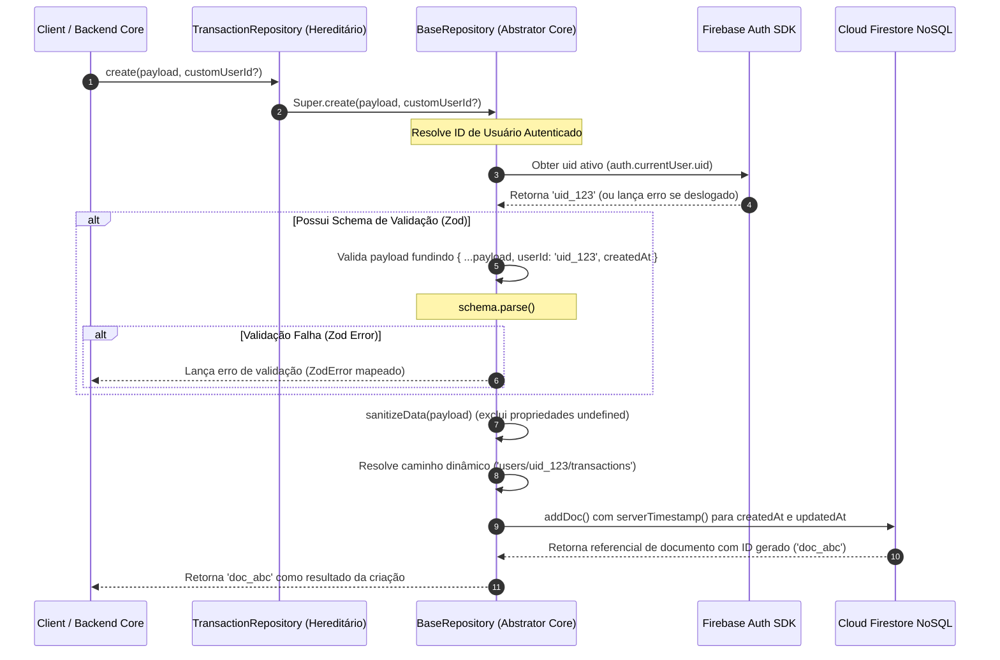

# 🗄️ Persistência de Dados, Firestore & BaseRepository (Fase 6)

Este documento dita e detalha a especificação técnica da camada de infraestrutura de dados e persistência do ecossistema **Aimee**, com foco no encapsulamento do **Google Cloud Firestore**, no design pattern de Repositórios e na herança estrutural da classe genérica **BaseRepository** localizados sob `/src/infrastructure`.

---

## 1. Visão Geral
Aimee adota os princípios de **Clean Architecture** (Arquitetura Limpa), separando de maneira estrita as regras de negócio puras (representadas pelas *Skills* no domínio) dos detalhes físicos do mecanismo de armazenamento. 

Esta separação impede o vazamento de termos e lógicas específicas do Firestore (como `QueryConstraints`, `CollectionReferences` ou `ServerTimestamps`) para as interfaces reativas do frontend (React) ou controladores do backend. Toda a comunicação com o banco de dados ocorre de forma assíncrona por meio de contratos tipados que herdam o comportamento unificado de uma classe abstratora genérica: o `BaseRepository`.

---

## 2. Abstração de Escopo e Responsabilidades
A camada de persistência em `/src/infrastructure/repositories` está segmentada em dois padrões lógicos de coleção do Firestore:

* **Subcoleções de Usuário (User Subcollections)**:
  * **Conceito**: Garante o isolamento físico de dados sensíveis e pessoais de maneira nativa. Cada registro pertence exclusivamente a um espaço aninhado do usuário dono da conta.
  * **Exemplo de Caminho no Firestore**: `users/{userId}/transactions`, `users/{userId}/tasks`, `users/{userId}/shopping_items`.
  * **Segurança**: Projetado para facilitar a validação em regras de segurança do Firestore (Firestore Rules) e garantir conformidade simplificada de LGPD/GDPR no expurgo automático de contas do usuário (`DELETE users/{userId}`).

* **Coleções Globais / Compartilhadas (Global Collections)**:
  * **Conceito**: Dados compartilhados entre usuários ou de leitura ampla do assistente, sem aninhamento sob o identificador do usuário na hierarquia primária.
  * **Exemplo de Caminho no Firestore**: `users` (Coleção base de perfis canônicos), `monitor_events` (Coleção global de cache de eventos coletados).

---

## 3. Fluxo Operacional de Gravação e Leitura

O diagrama a seguir exibe o ciclo operacional seguro de uma gravação (Create) utilizando herança e validação de runtime integrada com Zod:



---

## 4. Estrutura do BaseRepository (`BaseRepository.ts`)

O `BaseRepository` encapsula de forma genérica as operações canônicas de CRUD (Create, Read, Update, Delete) em conformidade com o Firestore SDK v9/v10 (Functional Syntax).

### Métodos e Assinaturas Principais:

#### A. Métodos de Escrita

* **`create(data: Omit<T, 'id' | 'createdAt' | 'updatedAt' | 'userId'>, customUserId?: string): Promise<string>`**
  * **Ação**: Realiza a criação física do registro. Resolve automaticamente a pasta raiz substituindo a marcação dinâmica `{userId}` no caminho físico da coleção.
  * **Timestamps**: Alimenta as propriedades `createdAt` e `updatedAt` de forma resiliente diretamente com buffers assíncronos do servidor (`serverTimestamp()`).
  * **Sanitização de Undefineds**: Limpa o modelo removendo atributos que possuam valor `undefined` (não suportados por padrão em gravações estritas no Firestore).

* **`update(id: string, data: Partial<T>, customUserId?: string): Promise<void>`**
  * **Ação**: Atualiza parcialmente atributos de um documento referencial ativo.
  * **Validação Parcial**: Executa validação parcial dinâmica via Zod dividindo o esquema de domínio com o método `.partial()`.
  * **Timestamps**: Força a atualização do atributo `updatedAt` de maneira global.

* **`delete(id: string, customUserId?: string): Promise<void>`**
  * **Ação**: Executa a destruição física do nó de dados correspondente de forma isolada ao escopo do usuário.

#### B. Métodos de Consulta e Filtros

* **`getById(id: string, customUserId?: string): Promise<T | null>`**
  * **Ação**: Extrai os dados do nó individual do banco unificando de maneira dinâmica os atributos à propriedade `id` do retorno.

* **`list(constraints: QueryConstraint[] = [], customUserId?: string): Promise<T[]>`**
  * **Ação**: Mapeia consultas amplas aceitando restrições flexíveis nativas do Firestore (`QueryConstraint` do tipo `where()`, `orderBy()`, `limit()`). 
  * **Agnosticismo de Coleção**: Abre a pesquisa sempre sob a pasta base dinâmica traduzida da coleção do usuário ativo.

---

## 5. Repositórios Especializados Ativos

Abaixo encontram-se descritas as implementações específicas que estendem o `BaseRepository`:

| Repositório Classe | Caminho do Firestore (Collection Path) | Schema de Validação (Models Zod) | Comportamentos Especiais / Customizados |
| :--- | :--- | :--- | :--- |
| **`TaskRepository`** | `users/{userId}/tasks` | `HouseholdTaskSchema` | Controla hábitats, agendamentos, check-ins e recorrências periódicas do lar. |
| **`TransactionRepository`** | `users/{userId}/transactions` | `TransactionSchema` | Orquestrador de registros de fluxo de caixa, despesas e receitas organizadas por categórias. |
| **`ShoppingRepository`** | `users/{userId}/shopping_items` | `ShoppingItemSchema` | Consolida o inventário dinâmico, monitor de despensas domésticas e controle geofenced. |
| **`ChatRepository`** | `users/{userId}/chats` | *Opcional* | Mantém o feed de histórico e logs de conversação das interações com o assistente. |
| **`ProfileRepository`** | `users` | `UserProfileSchema` | **Coleção Global**. Possui métodos customizados `getProfile()`, `updateProfile()` direcionais utilizando `uid` absoluto e gerenciamento privado de credenciais Google Workspace (`getGoogleCredentials()`). |
| **`EventRepository`** | `users/{userId}/events` | *Opcional* | Registra a sincronização física do mapeamento de compromissos gerados a partir do processamento de e-mails/IA. |
| **`ConfigRepository`** | `users/{userId}/configs` | *Opcional* | Mantém dados temporais de configurações gerais de conectividade do assistente. |
| **`MonitorEventRepository`** | `monitor_events` | `MonitorEventSchema` | **Coleção Global**. Integra o cache de eventos minerados na internet: possui busca reativa por datas (`findRecentEvents()`) e escrita otimizada transacional em lote via **Batched Write** salvando itens usando o hash MD5 dedup como ID (`saveBatch()`). |
| **`UsageRepository`** | `users/{userId}/usage` | `LLMUsageSchema` | Rastreia a auditoria sistemática de gasto cumulativo de tokens das conexões de IA. |

---

## 6. Mecanismo de Tratamento de Erro Integrado e Auditoria

Todas as falhas de conexão ou permissão geradas pelo motor interno do Firestore são interceptadas na camada base pelo método utilitário `handleFirestoreError`:

```typescript
protected handleFirestoreError(error: unknown, operationType: OperationType, path: string | null) {
  const errInfo: FirestoreErrorInfo = {
    error: error instanceof Error ? error.message : String(error),
    authInfo: {
      userId: auth.currentUser?.uid,
      email: auth.currentUser?.email,
      emailVerified: auth.currentUser?.emailVerified,
    },
    operationType,
    path
  };
  console.error(`Firestore Error [${operationType}] at ${path}:`, JSON.stringify(errInfo));
  throw new Error(JSON.stringify(errInfo));
}
```

### Robustez Produtiva do Fluxo:
* **Prevenção de Silêncio**: Garante que erros de rede ou de bloqueios nas Regras de Segurança do Firestore (ex: `Missing or insufficient permissions`) não fiquem escondidos da depuração técnica em produção (logs são escritos em formato JSON limpo e estruturado).
* **Rastreabilidade**: Associa dinamicamente o status de autenticação ativa do usuário no momento da falha (UUID, e-mail verificado), a operação executada (CREATE, UPDATE, LIST...) e o exato path de subcoleção acessado para simplificar a engenharia forense.

---

## 7. Dependências do Módulo
* **`firebase/firestore` (SDK do Firebase)**: Driver e gateway motor de transição reativa do NoSQL do Google.
* **`src/lib/firebase.ts`**: Repositório de configuração bootstrap de instâncias globais do Firebase (`db` e `auth`).
* **`zod`**: Validador de dados ativo nos processos pré-gravação.

---

## 8. Riscos Técnicos e Mitigações

* **Carga de Redundância de Rede em Listagens**: Consultas frequentes a coleções vastas do Firestore geram cobranças infladas de faturamento por leitura.
  * *Mitigação*: Os repositórios são acoplados à arquitetura de cache do Firestore em disco permitida nativamente no Firebase SDK móvel (Offline Persistence), reduzindo requisições redundantes de rede para dados estáticos.
* **Limitação de Operações em Lote (Batch Limits)**: Operações gravadas via `writeBatch` (como as mineradas pelo `MonitorEventRepository`) possuem um teto limite estrito de 500 escritas transacionais simultâneas por execução no Firestore.
  * *Mitigação*: Os mecanismos de mineração são fragmentados e as chamadas de gravação transacional limitam-se de forma programática a lotes de no máximo 100 itens simultâneos por persistência.

---

## 9. Pontos de Atenção Crítica
* **Uso de Variáveis Dinâmicas de Caminho (`{userId}`)**: Toda coleção designada com o prefixo dinâmico `{userId}` exige autenticação ativada. Invocações em momento de desconexão dispararão erros impessoais imediatos antes mesmo de buscar dados no Firestore.
* **Segurança de Mass Assignment**: Não repassar payloads não-sanitizados vindos do usuário diretamente para o método `update` ou `create`. Aimee protege esta via encapsulando o `sanitizeData` e validando os dados no Zod utilizando o esquema imutável correspondente.

---

## 10. Resumo Executivo
A camada de persistência e orquestração de banco de dados NoSQL sob `/src/infrastructure` viabiliza uma infraestrutura de dados ágil, isolada e com altíssimo nível de integridade. Através do reaproveitamento racional de assinaturas genéricas estendidas do `BaseRepository`, o monorepo simplifica o gerenciamento de subcoleções de múltiplos inquilinos (Multi-tenant), unifica tratamentos de segurança de autenticação nativamente e une validação robusta Zod ao motor transacional de borda do Cloud Firestore.
