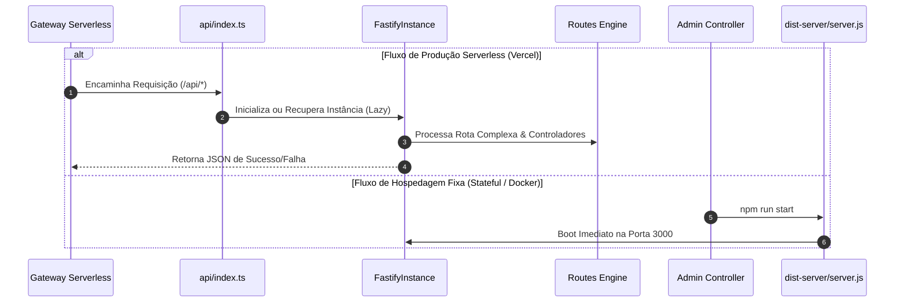

<!-- SYSTEM_METADATA_IGNORE_COGNITIVE_SEARCH: true -->
<!-- ARCHIVAL_STUB_ONLY -->

# ☁️ Gateways de Nuvem, Extensões & PWA Assets (Fase 3)

> ⚠️ **HISTORICAL DOCUMENT**: Este documento faz parte do histórico arquitetural do projeto (Aimee V1) e pode conter referências obsoletas a Express, CommonJS ou estruturas legadas de banco de dados. Para a arquitetura ativa de produção, consulte sempre a raiz `/docs/*.md` e `/docs/AGENTS.md`.

Este documento dita e detalha a especificação arquitetural da infraestrutura de hospedagem serveless (Vercel Functions), do orquestrador compilado de servidor e dos metadados de PWA contidos nos diretórios `/api`, `/dist-server` e `/public`.

---

## 1. Visão Geral
O ecossistema **Aimee** adota um modelo híbrido de implantação flexível. Ele foi projetado para operar tanto de forma Serverless na plataforma **Vercel** quanto de maneira autocontida tradicional (Stateful) em instâncias virtuais ou containers (Cloud Run/K8s).

A ponte de nuvem unifica o servidor Fastify e gerencia a entrega estática dos assets de interface do usuário, estendendo capacidades de suporte e resiliência offline (Progressive Web App - PWA).

---

## 2. Responsabilidades
As pastas de gateways de infraestrutura e carregamento estático operam nas seguintes fronteiras de responsabilidade:
* **`/api` (Vercel Serverless Wrapper)**: Atua como o ponto de entrada principal de API para a Vercel. Responsável pelo bootstrap tardio (Lazy) das dependências do backend Aimee e delegação transparente do ciclo de HTTP do Vercel para a instância em memória do Fastify.
* **`/dist-server` (Produção Compilada)**: Contém o bundle compilado autossuficiente do backend (`server.js`) gerado via `esbuild`. É o ponto de entrada ativo para servidores convencionais e sistemas de containers stateful.
* **`/public` (Assets de Borda e PWA)**: Gerencia o ciclo de cache offline, manifestos de identidade visual do aplicativo móvel hibridizado e ícones de launcher.

---

## 3. Fluxo Operacional



### Inicialização e Bootstrap Tardio (Lazy Evaluation)
Para suportar o ambiente de execução Serverless da Vercel sem penalizar o tempo de arranque (Cold Start) ou falhar na análise inicial de avaliação de variáveis, a função `/api/index.ts` utiliza **imports dinâmicos tardios**:
1. O servidor web Vercel carrega `/api/index.ts`. O interpretador avalia o arquivo sem processar o grafo complexo de dependências do Firebase ou IA immediately.
2. Na recepção da primeira chamada HTTP, o validador verifica se `fastifyInstance` na memória quente é nulo.
3. Caso nulo, dispara a sub-função assíncrona `initServer()`:
   - Carrega dinamicamente os contêineres de injeção de dependência (`tsyringe`), o orquestrador (`AimeeOrchestrator`), o arquivo de configurações e as rotas.
   - Registra extensões globais (`@fastify/cors`, `@fastify/middie`).
   - Valida as variáveis de ambiente ativas.
4. O servidor Fastify emite via barramento nativo (`emit('request')`) a execução da requisição delegada do Vercel `req` e `res`.

---

## 4. Serviços Principais (Descrição dos Módulos)

### A. `/api/index.ts` (Fastify Vercel Gateway)
* **Tipo**: Gateway Serverless / Handler de Borda.
* **Propósito**: Executa a transposição transparente de chamadas HTTP tradicionais para uma instância Fastify quente. Implementa proteção global de avaliação capturando quaisquer erros fatais no contexto de boot para evitar travamentos silenciosos nas funções edge da Vercel.

### B. `/dist-server/server.js` (Compiled Node.js Build)
* **Tipo**: Bundle de Servidor Compilado.
* **Propósito**: Gerado do build de `server.ts` via `esbuild` no formato de ES Modules (`esm`). Simplifica a portabilidade, removendo a necessidade de instalar dependências de desenvolvimento do TypeScript no ambiente de deploy de containers, operando de modo limpo e rápido.

### C. `/public/manifest.json` (PWA Metadata)
* **Tipo**: Descritor JSON de Aparência.
* **Propósito**: Identifica as regras estritas de integração do sistema operacional para o modo PWA:
  * Define o tema escuro (`#171717`) e cor de fundo (`#000000`).
  * Força visualização sob orientação retrato (`portrait`).
  * Apresenta ícones com características maskable específicos para suportar recorte circular nas telas iniciais mobile.

### D. `/public/sw.js` (Service Worker)
* **Tipo**: Proxy de Rede de Cliente.
* **Propósito**: Canaliza as requisições de rede do navegador local do usuário aplicando a estratégia **Network-First, Cache Fallback**:
  * Força ativação imediata ignorando tempos de espera (`self.skipWaiting()`).
  * Em caso de indisponibilidade extrema de conexão, realiza o fallback transparente redefinindo rotas de navegação para o buffer offline do `/index.html`.

---

## 5. Dependências Internas
* **`src/server/routes.ts`**: Conjunto definidor de endpoints canônicos de inteligência integrados.
* **`src/lib/config.ts`**: Validador de esquemas e tokens do Firebase e agentes de IA.
* **`/dist` (Código HTML/JS Minificado do Frontend)**: Alvo do cache e fallback operado pelo Service Worker.

---

## 6. Dependências Externas
* **`fastify` (v5+)**: Engine web estruturada principal de alta vazão no backend.
* **`@fastify/cors`**: Gerenciador de política CORS das origens permitidas (incluindo pontes mobile capacitor).
* **`@fastify/middie`**: Engine utilitária que possibilita executar middlewares baseados em assinaturas Connect/Express no Fastify.
* **`reflect-metadata`**: Biblioteca essencial para controle e resolução de injeção de dependência na camada de contêineres de negócios.

---

## 7. Fluxos Assíncronos
* **Lazy Module Initializer**: O carregamento assíncrono modular na rota `/api/index.ts` ocorre de forma isolada do fluxo síncrono do processador da Vercel, impedindo que falhas de token de IA quebrem a compilação ou o deploy.
* **Intercepção de Eventos de Rede**: No celular do usuário, as requisições executadas via Service Worker acontecem em background em uma thread apartada (V8 ServiceWorker), interceptando requisições sem congelar a thread principal de render do React.

---

## 8. Integrações
* **Vercel Edge Functions API**: Integração nativa com o sistema de orquestração de microsserviços da Vercel.
* **PWA Engine**: Suporte de primeira classe para adição à tela inicial nativa (A2HS) em navegadores Safari e Chrome e compatibilidade ampla de caching local de assets.

---

## 9. Estrutura Simplificada
```bash
├── api/
│   └── index.ts          # Arquivo controlador de transposição Fastify -> Vercel Serverless
├── dist-server/
│   └── server.js         # Produção compilada gerada pelo esbuild (Node.js)
└── public/
    ├── manifest.json     # Metadados e identidade visual para PWA/Adição de Home-screen
    └── sw.js             # Service Worker de controle e resiliência offline do Core
```

---

## 10. Riscos Técnicos
* **Cold Start Latency (Serverless)**: Em cenários onde o backend fica sem receber chamadas por algum tempo, a Vercel desliga o container modular. A primeira requisição subsequente (que executará o `initServer()` de forma assíncrona) pode sofrer uma latência superior a 2 segundos antes de liberar as rotas.
* **Sincronia e Atualização do Cache (Invalidation)**: Service Workers ativos podem reter arquivos HTML e JS antigos em cache local agressivamente. Se uma atualização crítica de segurança do cliente for publicada na web, os usuários com Service Work ativos podem demorar a visualizar, necessitando de uma reinicialização de aba ou expiração forçada.

---

## 11. Pontos Críticos
* **Diferença de Ambiente entre Fastify e Express**: Diferente de frameworks monolíticos clássicos, o Fastify não vem acoplado com sistema middleware nativo. A adição inadequada de Express Middlewares clássicos sem registrar o adaptador `@fastify/middie` causará falha instantânea e silenciosa no gateway `/api/index.ts`.
* **Segurança de Endereçamento de Módulos (CJS vs ESM)**: Como o projeto utiliza `"type": "module"` no `package.json`, todas as extensões resolvidas por imports explícitos devem carregar a extensão `.js` recomendada, mesmo sendo de código TypeScript, sob risco de quebra no importador de borda.

---

## 12. Sugestões Arquiteturais
* **Criação de Estratégia Stale-While-Revalidate**: Modificar a estratégia básica do `sw.js` para ativos estáticos como CSS, Fontes e Imagens para **Stale-While-Revalidate**. Isso permite carga imediata dos assets em cache no device do usuário enquanto busca a versão atualizada de forma assintótica em background.
* **Habilitação de Keep-Alive de Container**: Implementar chamadas cron periódicas de aquecimento (Heartbeat) na API de nuvems a cada 10 minutos para contornar o efeito indesejado dos Cold Starts em servidores serverless.

---

## 13. Resumo Executivo
Os gateways e extensões de nuvem do ecossistema Aimee em `/api`, `/dist-server` e `/public` consolidam a versatilidade de deploy. Proporcionam uma adaptação exemplar para arquiteturas sem servidor baseadas em microsserviços na Vercel via Fastify dinâmico, fornecem um build de servidor limpo e ágil de produção em container, e garantem uma experiência offline com identidade robusta por meio de especificações PWA.
