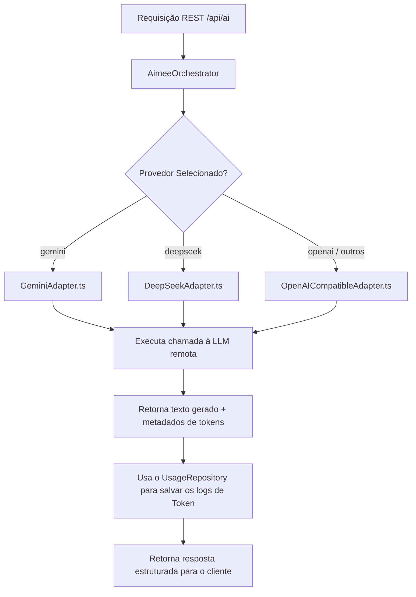

<!-- SYSTEM_METADATA_IGNORE_COGNITIVE_SEARCH: true -->
<!-- ARCHIVAL_STUB_ONLY -->

# ⚡ Servidor de Entrada, Orquestração & Provedores de IA (Fase 7)

> ⚠️ **HISTORICAL DOCUMENT**: Este documento faz parte do histórico arquitetural do projeto (Aimee V1) e pode conter referências obsoletas a Express, CommonJS ou estruturas legadas de banco de dados. Para a arquitetura ativa de produção, consulte sempre a raiz `/docs/*.md` e `/docs/AGENTS.md`.

Este documento dita e detalha a especificação técnica do servidor backend do ecossistema **Aimee**, baseado no microframework **Fastify** com suporte a injeção de dependência via **tsyringe**, adapters intercambiáveis de Inteligência Artificial e proxies seguros de geolocalização e calendário.

---

## 1. Visão Geral
Como um assistente avançado focado na blindagem e segurança de dados, o backend da Aimee é isolado e gerencia diretamente todas as chaves de API restritas e tokens de provedores externos (Google, OpenAI, DeepSeek, Firebase Admin). 

O servidor implementa as melhores práticas de Clean Architecture por meio de **Injeção de Dependências**, orquestração baseada em interfaces com múltiplos provedores de LLM (*ILLMProvider*), limitação rigorosa de requisições de borda (*Rate Limiting*) e delegação assíncrona de eventos de suporte e auditoria de faturamento de tokens.

---

## 2. Escopo
* **Injeção de Dependência Hermética (`/src/server/container.ts`)**: Gerenciamento unificado e registro centralizado de instâncias singletons do servidor.
* **Roteamento e Filtros e Validações (`/src/server/routes.ts`)**: Consolidação dos endpoints REST para bate-papo, agendamento de calendário, localização por geolocalização e envio de e-mails transacionais.
* **Adapters Polimórficos de IA (`/src/server/llm/`)**: Sistema robusto de adapters intercambiáveis que isola as lógicas de API do Gemini, DeepSeek e OpenAI sob a assinatura abstrata do `ILLMProvider`.
* **Middlewares de Segurança e Ciclo de Vida (`/src/server/middlewares.ts`)**: Sanitização, mapeamento global de erros fatais e logs transparentes de tráfego.

## 3. Fora do Escopo
* **Interface Visual de Administração**: Painéis de controle de visualização do servidor ou log de rotas ao usuário final.
* **Operações de Escrita Direta no Banco na Camada de Rota**: Rotas físicas não tocam o banco de dados diretamente; delegam integralmente para as Skills ou Repositórios do domínio.

---

## 4. Arquitetura (Módulos do Servidor)

O backend é organizado em módulos com responsabilidades muito bem delimitadas:

```
├── server.ts                    # Bootstrap do Fastify, Middlewares Core e integração Vite
├── src/server/
│   ├── container.ts             # Registrador de Container DI com tsyringe (Inversão de Controle)
│   ├── firebaseAdmin.ts         # Orquestrador inicializado seguro do Firebase Admin SDK
│   ├── googleAuth.ts            # Gerenciador de credenciais do OAuth2 do Google Calendar
│   ├── middlewares.ts           # Interceptores de log de requisições e sanitizações de Zod
│   ├── routes.ts                # Mapeador físico e injetor de barramento de endpoints REST
│   ├── services/
│   │   └── EmailService.ts      # Serviço transacional de mensageria smtp
│   └── llm/                     # Camada Hermética dos Motores Gerativos de IA
│       ├── ILLMProvider.ts      # Contrato canônico dos Provedores LLM
│       ├── AimeeOrchestrator.ts # Controlador cerebral centralizador de processamento
│       ├── GeminiAdapter.ts     # Adapter do SDK oficial @google/genai
│       ├── DeepSeekAdapter.ts   # Adapter da rede DeepSeek
│       └── OpenAICompatibleAdapter.ts # Suporte amplo para motores compativeis com OpenAI API
```

---

## 5. Contratos e Especificações de API (API Endpoints)

O roteador do Fastify mapeia de maneira segura as seguintes portas de comunicação REST em `/api`:

### A. AI Central Hub (`POST /api/ai`)
* **Propósito**: Canaliza prompts e interações diretas do usuário com a assistente, disparando o `AimeeOrchestrator`.
* **Segurança**: Rate limit restrito de no máximo 10 requisições por minuto por IP ativo. Passa por validação rigorosa de contrato pelo middleware com o esquema `aiRequestSchema`.
* **Payload Comum**:
```json
{
  "prompt": "Comprei 3 camisas R$ 120",
  "history": [],
  "persona": "analytical",
  "provider": "gemini",
  "userId": "uid_123"
}
```

### B. OAuth Google Connection e Callback (`GET /api/auth/google/url|callback`)
* **Propósito**: Conecta de forma autenticada as contas Google Workspace do usuário final sem expor segredos no cliente:
  * `/auth/google/url`: Retorna o endereço oficial de consentimento do Google Calendar preparado com offline access (`access_type: 'offline'`) solicitando escopos de calendário.
  * `/auth/google/callback`: Recebe o código temporário emitido do Google, recupera as credenciais e executa uma ponte por mensagem de janela (`window.postMessage`) para devolver os tokens decifrados à SPA de forma protegida.

### C. Calendar Sync APIs (`POST|PUT|DELETE /api/calendar/events`)
* **Propósito**: Cria, altera ou remove compromissos no Google Calendar:
  * **POST `/api/calendar/events`**: Insere um evento físico no calendário primário do usuário dono da credencial JWT enviada.
  * **PUT `/api/calendar/events/:id`**: Altera metadados e data de agendamento de uma reunião.
  * **DELETE `/api/calendar/events/:id`**: Exclui definitivamente um agendamento.

### D. Secure Location Bridge (`GET /api/location/nearby-markets`)
* **Propósito**: Proxy reverso de geolocalização interconectado à Google Places API. Recebe dados de latitude e longitude do dispositivo móvel do usuário, realiza a busca de supermercados em um raio de 5 km e higieniza a resposta de volta ao cliente.
* **Segurança de API Key**: O token e chave do Google Maps permanecem enterrados no backend (`config.google.mapsApiKey`), anulando vazamentos de faturamento de requisições maliciosas.

---

## 6. Fluxo de Decisões e Execução de IA

O `AimeeOrchestrator` centraliza e arbitra a execução gerativa decidindo o provedor, prompts de persona ativados e o histórico contextual de conversações:



* **Tratamento de Personalidade e Personalização**: O orquestrador aciona a classe `AimeePrompts.getSystemPrompt(persona)` para extrair a instrução de base imutável de sistema e a acopla à chamada final, forçando a LLM a manter o foco em produtividade real e a tom de voz correspondente.

---

## 7. Melhores Práticas de Robustez e Corner Cases (Resiliência)

O backend possui barreiras de resiliência ativa contra picos de tráfego e erros catastróficos de APIs externas:

* **Gerenciador de Falhas de Framework**:
  Se alguma rota quebrar por falha de banco de dados ou erro de timeout de IA, o `fastify.setErrorHandler` captura o erro e despacha JSONs padronizados:
  * Tratamento de erros de validação (Zod): Retorna HTTP `400 Bad Request` detalhando de maneira estrutural em qual propriedade ou tipo o payload foi invalidante.
  * Falhas gerais: Retorna HTTP `500 Internal Server Error` e emite logs estruturados detalhados para o serviço central de observabilidade sem revelar segredos para o usuário.
* **Prevenção de Ataques de Força Bruta (Rate Limit)**:
  O módulo `@fastify/rate-limit` é ativado em todas as rotas limitando IPs abusivos e fornecendo resposta de cabeçalhos de reset claros para que a SPA no navegador saiba quando tentar novamente de forma progressiva.

---

## 8. Critérios de Aceite
1. Todas as rotas base devem responder sob o prefixo `/api` de forma isolada do encapsulador estático de SPA, retornando HTTP `404` caso rotas de API inexistentes sejam requisitadas.
2. Nenhuma rota de API deve revelar ou vazar chaves de API cruas nos cabeçalhos ou corpos de resposta JSON.
3. Todas as chamadas ao `/api/ai` devem passar pela barreira Zod validando o prompt e salvando logs estruturados de tokens de faturamento no Firestore sem overhead assíncrono.

---

## 9. Resumo Executivo
Os serviços de entrada, infraestrutura de rotas e orquestradores estruturados sob `/src/server` e `/server.ts` formam uma fortificação segura e estritamente tipada para o recebimento de dados da Aimee. A adoção de inversão de controle via contêineres de injeção de dependência e desacoplamento em adapters intercambiáveis de inteligência garante uma flexibilidade exemplar de faturamento, simplifica a expansão de novos endpoints integrados e preserva com excelência a segurança geral das credenciais sensíveis e faturadas do assistente.
