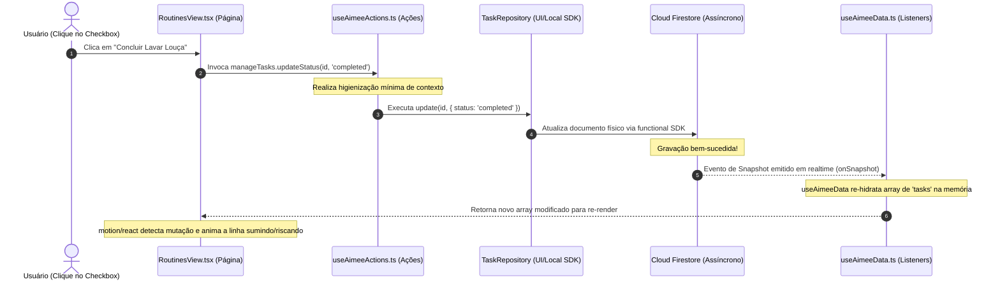

<!-- SYSTEM_METADATA_IGNORE_COGNITIVE_SEARCH: true -->
<!-- ARCHIVAL_STUB_ONLY -->

# 📱 Interface do Usuário, Client React SPA & Motion UX (Fase 8)

> ⚠️ **HISTORICAL DOCUMENT**: Este documento faz parte do histórico arquitetural do projeto (Aimee V1) e pode conter referências obsoletas a Express, CommonJS ou estruturas legadas de banco de dados. Para a arquitetura ativa de produção, consulte sempre a raiz `/docs/*.md` e `/docs/AGENTS.md`.

Este documento dita e detalha a especificação técnica da interface do usuário (UI) do ecossistema **Aimee**, uma SPA (Single Page Application) construída em **React 18+ com Vite**, estilizada recursivamente com **Tailwind CSS**, orquestrada por hooks de estado reativo e animada fluentemente com o motor **motion/react**.

---

## 1. Visão Geral
Como assistente integrada ao cotidiano familiar, a interface da Aimee prioriza uma experiência **Mobile-First** refinada e tátil de alta fidelidade visual, inspirada na fluidez e microinterações de grandes sistemas operacionais (como o ecossistema iOS/Apple Music). 

A arquitetura da interface divide as telas em abas dinâmicas, mantendo o controle total de estados distribuído de forma unidirecional (One-Way Data flow): os painéis consubstanciam dados reativos vindos de listeners assíncronos em tempo real (*onSnapshot*) e emitem chamadas para hooks acopladores (*useAimeeActions*) que processam as validações locais antes de interagir com o ecossistema do servidor.

---

## 2. Responsabilidades dos Diretórios do Cliente
A visualização do cliente em `/src/client` é dividida sob limites lógicos estritos:
* **`App.tsx` (Casca de Navegação Principal)**: Gerencia o bootstrap visual, o ciclo de vida da autenticação, o sincronismo das abas ativas armazenadas em cache local (`localStorage`) e envolve as sub-páginas com Suspense para carregamentos lazy.
* **`/src/client/pages/` (Páginas de Escopo / Abas)**: Consolida as visões dedicadas do negócio (Bate-papo, Finanças, Compras, Rotinas e Painel de Configurações).
* **`/src/client/components/` (Componentes Isolados / Reutilizáveis)**: Blocos de UI desacoplados e purificados visando alta cobertura de tela, feedbacks visuais de rede e blocos de suporte integrado (ex: Visualizador de áudio, Avatar animado, Status de conectividade offline).
* **`/src/client/hooks/` (Hooks de Estado e Comportamento)**: Ganchos puramente React que isolam as chamadas de banco e inteligência da casca de renderização de componentes, otimizando o re-render através de primitivos estáveis no Firestore.

---

## 3. Fluxo de Estado Unidirecional (UI Client Lifecycle)

O fluxo a seguir mapeia como uma modificação de estado na tela (ex: concluir uma tarefa doméstica) propaga do componente React, passa pelas validações locais e persiste reativamente na tela:



---

## 4. Estrutura de Páginas (Views)

Cada aba mapeia uma competência exclusiva da assistente:

### A. ChatView (`ChatView.tsx`)
* **Propósito**: Canal primário de conversação natural e comandos vocalizados com a Aimee.
* **Componentes Exclusivos**:
  * **AudioVisualizer**: Animação em canvas do microfone interpretando ondas sonoras via Web Audio API durante comandos de voz.
  * **AimeeAvatar**: Expressão facial reativa do assistente que pisca, sorri e se move dinamicamente conforme os status de processamento da IA (`thinking`, `listening`, `idle`).
  * **ReactiveFeed**: Feed otimizado de mensagens instantâneas com rolagem ancorada e renderização elegante de blocos markdown.

### B. FinanceView (`FinanceView.tsx`)
* **Propósito**: Dashboards de controle financeiro do lar.
* **Componentes Exclusivos**:
  * **Gráficos Recharts**: Visualizadores fluidos de faturamento familiar, balanços, e despesas separadas por categoria.
  * **Interactive Goals**: Régua interativa de progresso tátil exibindo metas de orçamento poupado e economias programadas.

### C. RoutinesView (`RoutinesView.tsx`)
* **Propósito**: Gerenciador de calendário integrado e escala de responsabilidades domésticas.
* **Componentes Exclusivos**:
  * **Weekly Planner**: Seletor horizontal deslizante de dias da semana idealizado para dedões em telas móveis.
  * **Gamified Grid**: Listagem de tarefas que atualiza instantaneamente a fita de pontos e streaks de progresso do usuário final.

### D. ShoppingView (`ShoppingView.tsx`)
* **Propósito**: Monitoramento e abastecimento de insumos e listas de mantimentos.
* **Componentes Exclusivos**:
  * **Market List Checklist**: Itens categorizados dinamicamente por seções de supermercado (Higiene, Carnes, Padaria) com micro-transição para a despensa ativa ao concluir carrinhos.

### E. SettingsView (`SettingsView.tsx`)
* **Propósito**: Configurações gerais, personalização e painel administrativo de aprovação/compartilhamento de casas.

---

## 5. Arquitetura de Transições e Animations Core (Motion UX)

As transições de abas e estados utilizam a biblioteca **`motion/react`** (Vanguardista do Motion Library) para eliminar quebras bruscas visuais:

```typescript
// Configuração canônica de deslize bidirecional (App.tsx UI Slider)
export const slideVariants = {
  enter: (direction: number) => ({
    opacity: 0,
    x: direction > 0 ? 120 : -120,
    scale: 0.98
  }),
  center: {
    opacity: 1,
    x: 0,
    scale: 1,
    transition: {
      duration: 0.25,
      ease: [0.16, 1, 0.3, 1] // Apple Fluid Cubic-Bezier
    }
  },
  exit: (direction: number) => ({
    opacity: 0,
    x: direction < 0 ? 120 : -120,
    scale: 0.98,
    transition: {
      duration: 0.2
    }
  })
};
```

### Princípios do Motion UX aplicados:
* **Layout Animations (`layoutId`)**: Elementos em transição (como o marcador de menu sob a aba ativa) arrastam-se suave e nativamente entre posições contínuas de tela (Shared Layout Transitions).
* **AnimatePresence**: Garante que listas deletadas e cards completados executem animações de fade-out ou recolhimento antes de sumirem fisicamente da árvore DOM, reduzindo saltos abruptos de scroll.

---

## 6. Ganchos Reativos (Custom Client Hooks)

* **`useAuth`**: Gerencia o estado físico de autenticação por Firebase Auth. Modera o listener de perfis ativos e valida se o e-mail ou IP possui pendências de aprovação de segurança administrativa antes de revelar as Views Core.
* **`useAimeeData`**: Encapsula múltiplos sub-listeners ativos do Firestore (`onSnapshot`). Centraliza dados familiares compartilhados sob escopos espaciais ativos (`activeSpace`), permitindo alternar de "Casa Própria" para "Casa de Campo" com atualização integral em tempo de execução.
* **`useAimeeActions`**: Facilita a blindagem de chamadas, convertendo gatilhos da visualização React em transações consistentes e unificadas para a camada de persistência infra do projeto.
* **`useVoiceRecorder`**: Captura fluxos brutos de gravação do microfone do celular, converte para payloads compatíveis e delega ao backend do assistente para transcrição de áudio nativa.

---

## 7. Riscos Técnicos e Mitigações

* **Gargalos de Desempenho por listeners múltiplos ativos (onSnapshot)**: Abas inteiras recarregando layouts inteiros em pequenos ticks de dados podem congelar celulares antigos de usuários.
  * *Mitigação*: Utilização sistemática de técnicas de memorização de componentes (`React.memo`) e desmembramento lógico de listeners globais no final do ciclo de desmontagem de componentes (`useEffect` retornando `unsubscribe()`).
* **Vazamento de Fluxo Offline (Falta de Conectividade)**: Operações gravadas em modo offline pelo Firestore duráveis em cache não informando o usuário visualmente causam confusão.
  * *Mitigação*: O componente global `NetworkStatus.tsx` monitora conexões offline síncronas (`navigator.onLine`), exibindo avisos visuais discretos e flutuantes de sincronia sem bloquear a digitação contínua de tarefas ou faturas.

---

## 8. Critérios de Aceite
1. O cliente React deve compilar limpo de qualquer erro sem usar propriedades depreciadas de animações.
2. Abas de navegação devem persistir a página corrente no `localStorage` sob a chave correspondente.
3. Micro-interações táteis (efeitos de hover ativo, toques em checkboxes e listagens dinâmicas) devem reagir instantaneamente utilizando amortecedores físicos do `motion/react`.

---

## 9. Resumo Executivo
A interface gráfica de front-end reativa da Aimee consolida uma experiência do usuário altamente sofisticada, focada em fluidez e reatividade instantânea. A separação clara entre renderização declarativa de componentes e lógica pura injetada via Hooks Customizados, somada à transições calculadas por curvas fluidas clássicas do iOS com `motion/react`, confere ao ecossistema Aimee uma interface incrivelmente premium, responsiva a múltiplos tamanhos de tela e blindada contra falhas ou instabilidades de conectividade offline.
