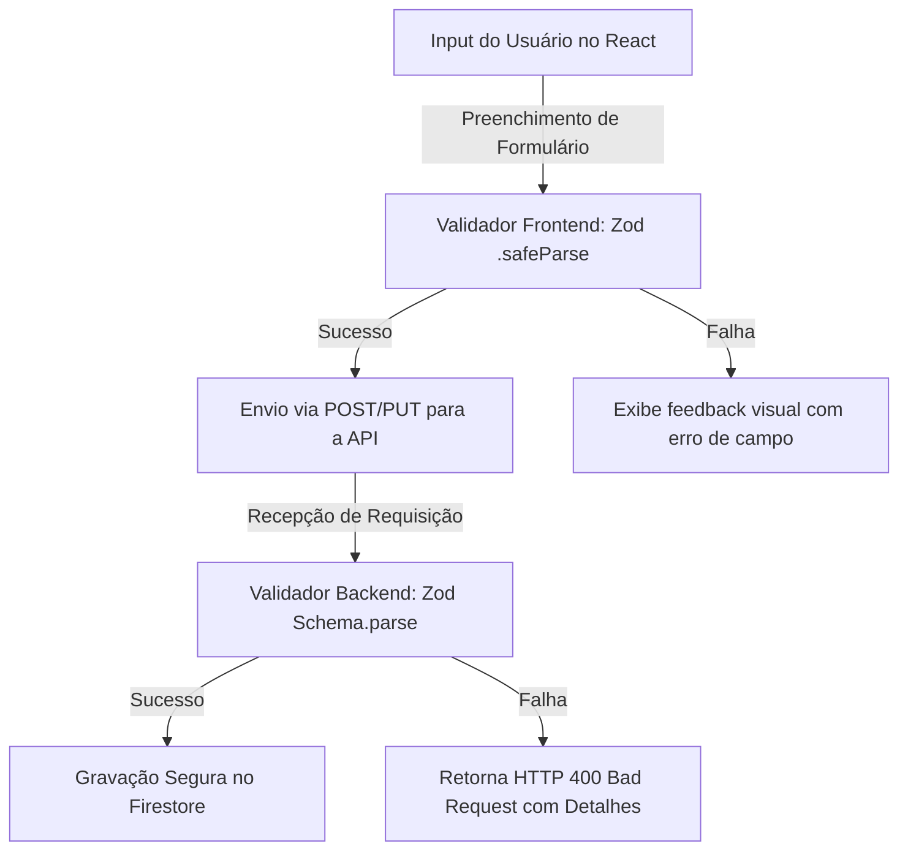

<!-- SYSTEM_METADATA_IGNORE_COGNITIVE_SEARCH: true -->
<!-- ARCHIVAL_STUB_ONLY -->

# 📋 Contratos Core, Modelagem de Dados & Validação Zod (Fase 4)

> ⚠️ **HISTORICAL DOCUMENT**: Este documento faz parte do histórico arquitetural do projeto (Aimee V1) e pode conter referências obsoletas a Express, CommonJS ou estruturas legadas de banco de dados. Para a arquitetura ativa de produção, consulte sempre a raiz `/docs/*.md` e `/docs/AGENTS.md`.

Este documento dita e detalha a especificação das entidades de domínio, regras estritas de tipagem em TypeScript e esquemas bi-direcionais de validação em tempo de execução via **Zod** sob `/src/types` e `/src/models`.

---

## 1. Visão Geral
Como um ecossistema fullstack com persistência em banco de dados NoSQL (Google Cloud Firestore), a Aimee necessita de uma blindagem rigorosa contra inconsistências de dados (Data Corruption). 

Para isso, o projeto implementa o padrão **Single Source of Truth (SSOT)**: os tipos estáticos do TypeScript são inferidos matematicamente a partir de declaradores funcionais da biblioteca Zod. Dessa forma, as mesmas regras que realizam o parse sanitário na recepção das requisições REST da API no backend também validam os inputs dos formulários no frontend do cliente, anulando divergências de contrato.

---

## 2. Responsabilidades
Os módulos sob as pastas de tipagem agem de forma centralizada:
* **`/src/models/index.ts` (Core Entity Models)**: Consolida a modelagem canônica de todas as entidades de persistência de banco de dados e controle comportamental das abas do sistema (Ex: Usuários, Transações, Hábitos/Tarefas, Eventos, Logs de Auditoria de IA).
* **`/src/types/schemas.ts` (API Request & Response Interfaces)**: Define os esquemas e tipos canônicos de entrada de transição para requisições de mensageria da IA, formulários de suporte ao cliente e feeds de envio de e-mails de alerta.
* **`/src/types/index.ts` (Public Type Bundler)**: Exporta de forma transparente os modelos centralizados para o restante do monorepo, atuando no suporte de retrocompatibilidade de pacotes e simplificando caminhos de importação.

---

## 3. Fluxo Operacional



### Validação Bidirecional e Parsing Sanitário
Quando operações críticas de escrita ocorrem (Ex: Criação de Tarefa Doméstica ou Registro Financeiro):
1. No Frontend, os componentes React utilizam as validações do Zod para garantir de forma visual que regras mínimas foram cumpridas (ex: que valores numéricos são positivos e strings não estão vazias).
2. Na Borda, a chamada REST que transporta o JSON de carga passa por middlewares dedicados de validação. O Zod purifica o input eliminando propriedades extras indesejadas (Mass Assignment Protection) usando o comportamento de parse.
3. Se o parse do Zod falhar, o pipeline do Fastify/Express aborta a requisição reativamente respondendo com o schema estruturado de erros do Zod que é exibido de volta ao usuário de maneira transparente.

---

## 4. Modelagem de Entidades Principais (Zod Schemas)

Abaixo estão detalhados os principais contratos definidos no núcleo de `/src/models/index.ts`:

### A. Perfil de Usuário (`UserProfileSchema`)
Controla o cadastro, preferências, gamificação, bios, avatar dinâmico e preferências da persona do assistente:
* **`uid`**: String identificadora física gerada pelo Firebase Authentication.
* **`displayName` & `nickname`**: Nome legal do usuário e apelido carinhoso para vocalização do assistente.
* **`status`**: Estado do ciclo (`UserStatus`: `pending`, `approved`, `rejected`, `blocked`).
* **`selectedPersona`**: Persona ativa de voz/respostas da IA (`funny`, `analytical`, `frugal`).
* **`gamification`**: Sistema de pontuação ativo que contabiliza `points`, `level`, `badges` (medalhas conquistadas), e metas semanais de gastos.
* **`preferences`**: Configurações de exibição monetária (`currency`) e ativação de notificações push.

### B. Transação Financeira (`TransactionSchema`)
Modelagem para receitas e despesas monetárias do contexto familiar:
* **`amount`**: Número que representa a quantia (obrigatoriamente não-negativa, default `0`).
* **`type`**: Identificador canônico do fluxo da transação (`TransactionType`: `income` ou `expense`).
* **`category`**: Classificação taxonômica da transação (ex: `supermarket`, `entertainment`, etc).
* **`date`**: Representação de data que passa por refinamento estruturado para validar se é parseável por data real JS.

### C. Itens de Compra e Estoque (`ShoppingItemSchema`)
Monitoramento inteligente de mantimentos e insumos:
* **`name` & `quantity`**: Nome do item de supermercado e quantitativa vinculada (mínimo `0`).
* **`purchased`**: Booleano flag indicando se já foi adquirido pelo usuário.
* **`urgency`**: Nível de priorização de compra do mantimento (`low`, `medium`, `high`).
* **`isStock` & `frequency`**: Identificador se é parte do estoque fixo recorrente e frequência de reabastecimento.
* **`latitude` / `longitude` / `locationName`**: Metadados de GPS associando coordenadas ao estabelecimento para mapeamentos de geofence.

### D. Tarefa Doméstica / Hábito (`HouseholdTaskSchema`)
Gerenciador de tarefas e recorrências de rotinas:
* **`category`**: Classificação de responsabilidade (`TaskCategory`: `cleaning`, `maintenance`, `errand`, `other`).
* **`status`**: Estado operacional da tarefa (`todo` ou `done`).
* **`time`**: String representadora de hora militar blindada por expressão regular rígida (`/^([01]\d|2[0-3]):?([0-5]\d)$/` validando formato real de 24h `HH:mm`).
* **`recurrence`**: Um sub-objeto opcional (`TaskRecurrenceSchema`) que mapeia regras avançadas de calendário (`daily`, `weekly`, `monthly`, `annual`), contendo intervalos específicos de saltos e arrays de dias de execução permitidos (ex: `daysOfWeek` de 0 a 6).

### E. Monitor de Eventos Externos (`MonitorEventSchema`)
Utilizado para ingestão de eventos coletados e curados na rede pela inteligência:
* **`hash`**: Assinatura criptográfica md5/sha256 usada para deduplicação na coleta.
* **`format`**: Formato do evento (`presencial`, `online`, `hibrido`, `desconhecido`).
* **`confidence`**: Score numérico decimal calibrador do nível de confiança de IA geradora (mínimo `0.0`, máximo `1.0`).

### F. Auditoria de Tokens (`LLMUsageSchema`)
* **`model`**: Identificador do wrapper de IA ativo (ex: `gemini-1.5-flash`).
* **`promptTokens` / `completionTokens` / `totalTokens`**: Inteiros obrigatórios de controle de faturamento de requisição gerativa.

---

## 5. Dependências Internas
* **Nenhuma**: Por boas práticas de Clean Architecture na separação de responsabilidades (Decoupling), a pasta `/src/models/` não importa recursos de mais nenhuma pasta funcional de negócio do monorepo (como `/src/client`, `/src/server` ou `/src/infrastructure`). Ela está livre de acoplamento cilíclico inverso.

---

## 6. Dependências Externas
* **`zod` (v3+)**: Biblioteca motora e mandatória responsável pelo parsing e tipagem de runtime declarativa.

---

## 7. Fluxos Assíncronos
Os esquemas Zod são primariamente síncronos por questões de velocidade de cálculo. No entanto, sua inferência e métodos auxiliares de parse podem ser invocados com Promises assíncronas (`.parseAsync()`) quando integrados a validações complexas que consultam dados remotos temporais na nuvem (ex: verificar duplicidade de hash ou se ID externo do criador realmente existe no repositório de usuários antes de persistir dados).

---

## 8. Integrações
* **TypeScript Language Service**: Integração direta via inferência estática automática por metaprogramação (`z.infer<typeof Schema>`).
* **Firebase Firestore Document Converter**: Adaptador que utiliza os validadores Zod para higienizar dados antes de serializar documentos binários para o banco de dados.

---

## 9. Estrutura Simplificada
```bash
├── src/
│   ├── models/
│   │   └── index.ts          # Definições canônicas de modelos e enums gerais (Zod)
│   └── types/
│       ├── index.ts          # Exportador genérico unificado de contratos
│       └── schemas.ts        # Esquemas de entrada de dados de API, Suporte e IA Requests
```

---

## 10. Riscos Técnicos
* **Dessincronização de Enums em TypeScript nativo vs Zod**: O uso de enums puros do TypeScript em conjunto com Zod requer declarações nativas duplicadas em memória via `.nativeEnum()`. A alteração imprudente de um enum nativo para objeto imutável sem ajustar o declarador Zod quebrará imediatamente a compilação.
* **Sobrecarga de Parser Complexo no Frontend**: Schemas gigantescos com dezenas de validações encadeadas (`.refine()`, `.transform()`) aumentam o tamanho final do bundle de cliente que é descarregado nos celulares, podendo aumentar ligeiramente o tempo de carregamento da interface em conexões baixas 3G/4G. Elas devem ser mantidas enxutas.

---

## 11. Pontos Críticos
* **Ausência do sufixo `.js` nos imports no ecossistema ESM**: Como o projeto transpila código TypeScript para ES Modules padrão, o compilador exige que os caminhos relativos internos apontem com a extensão final transpilada de produção. Por exemplo: `export * from '../models/index.js';`. Omitir a extensão `.js` disparará erros de resolução de caminhos na execução nativa do Node em servidores Cloud Run ou de forma local.

---

## 12. Sugestões Arquiteturais
* **Geração Automática de Formulários Reativos (Auto-form)**: Criar uma fábrica de componentes visuais no React capaz de gerar formulários inteiros de maneira automatizada apenas consumindo o esquema do Zod (como faz o Shadcn UI React Hook Form de forma unificada), reduzindo drasticamente o código boilerplate de formulários redundantes de inputs e botões.

---

## 13. Resumo Executivo
Os contratos e modelagens modelares sob `/src/types` e `/src/models` formam a fundação sistêmica estável e segura do ecossistema da Aimee. O acoplamento perfeito das garantias de tipos do TypeScript à engenharia de validação de runtime declarativa do Zod garante integridade absoluta de ponta a ponta desde a interface do usuário PWA mobile até o núcleo NoSQL Firestore no backend, eliminando riscos de desregulação estrutural de dados.
