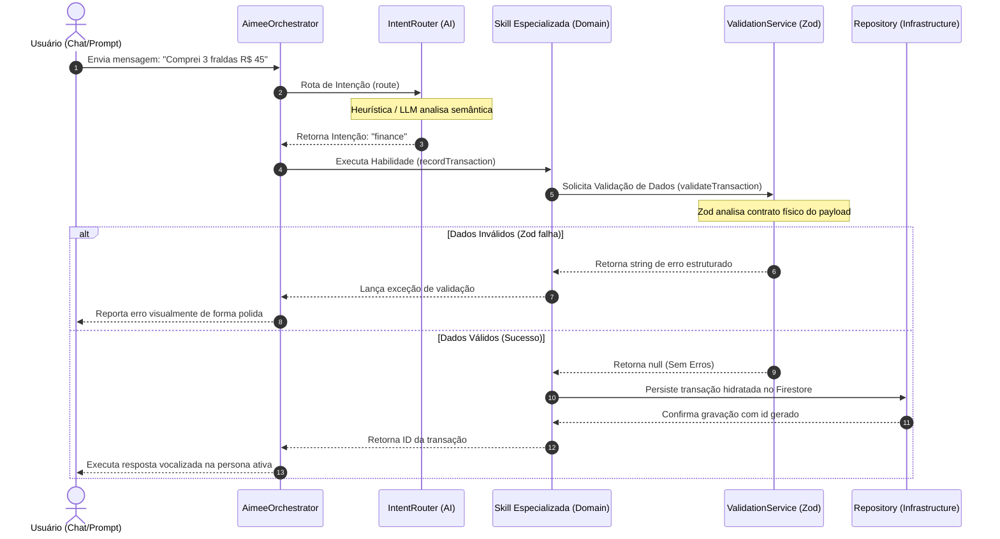
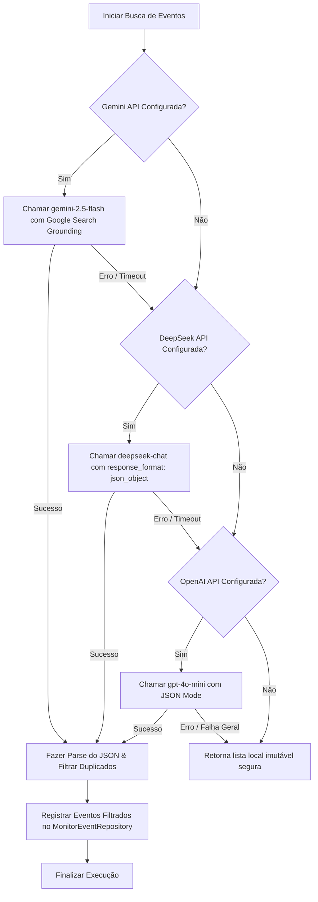

<!-- SYSTEM_METADATA_IGNORE_COGNITIVE_SEARCH: true -->
<!-- ARCHIVAL_STUB_ONLY -->

# 🧠 Regras de Domínio, Inteligência & Habilidades da Aimee (Fase 5)

> ⚠️ **HISTORICAL DOCUMENT**: Este documento faz parte do histórico arquitetural do projeto (Aimee V1) e pode conter referências obsoletas a Express, CommonJS ou estruturas legadas de banco de dados. Para a arquitetura ativa de produção, consulte sempre a raiz `/docs/*.md` e `/docs/AGENTS.md`.

Este documento dita e detalha a especificação das regras de negócio, da arquitetura de inteligência artificial baseada em habilidades (skills), classificação de intenções e do motor preditivo de insights contidos na pasta `/src/domain`.

---

## 1. Visão Geral
O diretório `/src/domain` é o núcleo intelectual absoluto do ecossistema **Aimee**. Ele abriga as regras de domínio independentes de frameworks de infraestrutura (Clean Architecture), o orquestrador de habilidades especializadas (Skills), os controladores de prompt e personalidade, e a inteligência preditiva de monitoramento.

Aimee não opera como um chatbot reativo simples. Sua inteligência de negócios é dividida em **Habilidades Especializadas (Skills)** isoladas que atuam como orquestradores determinísticos e generativos, validando, sanitizando e enriquecendo as solicitações do usuário antes que qualquer escrita no banco de dados ocorra.

---

## 2. Responsabilidades dos Subdiretórios
O domínio está modularizado em cinco subdiretórios com limites arquiteturais nítidos:
* **`/src/domain/entities` (Entidades Básicas)**: Declara os tipos e interfaces fundamentais compartilhados por todos os objetos persistidos do domínio (ex: `BaseEntity.ts` mapeando id, timestamps e vinculação de usuário).
* **`/src/domain/services` (Serviços de Domínio)**: Implementa utilitários agnósticos de suporte às operações de negócios, com destaque para o `ValidationService`, que atua como barreira de validação síncrona usando contratos Zod.
* **`/src/domain/validation` (Esquemas Adicionais)**: Repositor de regras de higienização secundárias, isoladas dos contratos NoSQL puros da base de dados.
* **`/src/domain/skills` (Habilidades do Assistente)**: Implementações encapsuladas das verticais de produtividade e estilo de vida (Finance, Shopping, Routine, EventDiscovery). Realizam transações de dados, sincronizações inteligentes e consultas integradas.
* **`/src/domain/intelligence` (Motores de IA & Roteamento)**: Gerencia o ciclo de interpretação semântica e geração preditiva.
  * `IntentRouter`: Classifica requisições em intenções funcionais claras.
  * `InsightEngine`: Extrai insights estatísticos e determinísticos cruzando evidências de bases distintas.
  * `AimeePrompts`: Modula o tom de voz e as regras de ouro por personas (`funny`, `analytical`, `frugal`).

---

## 3. Fluxo de Execução da Inteligência

O diagrama abaixo ilustra como a intenção do usuário é processada, roteada para uma Skill dedicada, validada e persistida:

---

## 4. Habilidades Principais (Core Skills)

### A. FinanceSkill (`/src/domain/skills/FinanceSkill.ts`)
* **Responsabilidade**: Orquestra o ciclo financeiro familiar. No registro de gastos ou despesas, ela intercepta o payload, chama o validador sanitário, hidrata os metadados de auditoria e invoca o repositório.
* **Inovações**:
  * Realiza agregação agregada sob demanda (`getSummary()`) computando saldos históricos entre receitas (`income`) e despesas (`expense`).
  * Gera quebra de categorias dinâmica em tempo de execução (`getCategoryBreakdown()`).
  * Calcula a taxa de poupança percentual (`getSavingsRate()`) para apoiar análises do assistente.

### B. ShoppingSkill (`/src/domain/skills/ShoppingSkill.ts`)
* **Responsabilidade**: Gerencia a lista de compras reativa e o inventário de despensa doméstica.
* **Inovações**:
  * **Tratamento Inteligente de Duplicatas**: Se um item já existe na lista ativa com status pendente, a habilidade incrementa automaticamente a quantidade desejada ao invés de duplicar a linha no banco de dados.
  * **Ciclo de Reabastecimento (Finalização)**: No ato de finalização da compra no mercado (`finalizeShopping()`), ela desloca dinamicamente todos os itens recém-comprados de "Lista de Compras Pendentes" para "Estoque Ativo da Despensa" e atualiza o timestamp `lastPurchasedAt` de forma transacional.

### C. RoutineSkill (`/src/domain/skills/RoutineSkill.ts`)
* **Responsabilidade**: Governa a agenda integrada de compromissos familiares, eventos locais e as tarefas preventivas do lar.
* **Inovações**:
  * **Motor de Recorrência Integrado**: Ao registrar tarefas recorrentes (`addTask()` contendo `recurrence`), ela utiliza um utilitário de calendário (`generateRecurrenceInstances`) para expandir e projetar múltiplos documentos agendados (instâncias de sub-tarefas) na base física NoSQL.
  * **Operações Recursivas de Escopo**: Na exclusão ou alteração de tarefas dentro de cadeias recorrentes, permite que o usuário altere apenas a instância atual (`single`), as instâncias vindouras (`following`), ou a totalidade histórica da recorrência (`all`).

### D. EventDiscoverySkill (`/src/domain/skills/EventDiscoverySkill.ts`)
* **Responsabilidade**: Varredura cibernética ampla e curadoria inteligente de eventos profissionais futuros relacionados aos temas de interesse do usuário no Brasil.
* **Fluxo de Multi-Model Fallback com Grounding e Recuperação de Tokens**:

* **Estruturação Robusta**:
  * **Google Search Tool Grounding**: Utiliza o poder de inteligência em tempo real da ferramenta de pesquisa do Gemini para varrer plataformas reais como Sympla, Meetup e portais locais, combatendo alucinações e garantindo que os eventos retornados realmente existem.
  * **Recuperação e Auditoria Detalhada de Faturamento (Token Usage)**: Em cada chamada de API das LLMs (seja Gemini, DeepSeek ou OpenAI), a habilidade captura as métricas oficiais de tokens consumidos no prompt e na resposta (`usageMetadata`, `usage`), registrando os metadados de faturamento no repositório de log para controle e auditoria futuros.
  * **Agnosticismo de Protocolo e Deduplicação Silenciosa**: Utiliza algoritmos de hashing criptográfico `md5`/`sha256` criados a partir do título, local e data para garantir deduplicação na gravação. Se um evento já existe no cache do banco, ele ignora sem criar duplicidades poluentes no feed.

---

## 5. InsightEngine (`/src/domain/intelligence/InsightEngine.ts`)

O `InsightEngine` é um motor autônomo, deterministicamente projetado, que cruza dados complexos em memória RAM para gerar recomendações inteligentes (Aimee Insights) sem onerar dependências externas de chamadas de LLM a todo segundo:

* **Estratégia de Confiabilidade de Insights**:
  * 🟢 **`confirmed` (Confirmado)**: Insights matematicamente exatos originados de dados históricos determinísticos da base do usuário (ex: Alerta de Tarefas atrasadas no calendário, Valor total exato gasto no mês, Categoria financeira dominante que rompeu metas de faturamento em 40% do total).
  * 🟡 **`inferred` (Inferido / Estatístico)**: Recomendações estatísticas e comportamentais extrapoladas de tendências do usuário.
* **Modelo Matemático Preditivo de Consumo de Despensa (Estoque)**:
  O motor monitora e avalia o histórico de compras de mantimentos (ex: leite) para prever reabastecimento antes dele acabar:
  $$\Delta T_{\text{média}} = \frac{1}{N-1}\sum_{i=1}^{N-1} (D_{i} - D_{i+1})$$
  Onde $D_i$ e $D_{i+1}$ são as datas das compras consecutivas do mesmo item e $N$ é o número de compras registradas.
  Assim que a data atual ($T_{\text{hoje}}$) cruza a margem de segurança do desvio médio:
  $$T_{\text{hoje}} - D_{\text{recente}} \geq (\Delta T_{\text{média}} - 1)$$
  O motor gera automaticamente um alerta inferido de "Previsão de Estoque", sugerindo a reinserção preventiva do insumo na lista ativa de compras.

---

## 6. Dependências Internas
* **`/src/infrastructure/repositories` (Camada Inferior)**: Invocado de forma de injeção de conexões para realizar gravações físicas indiretas.
* **`/src/types` (Contratos Internos)**: Consome todas as definições estruturais canônicas.
* **`/src/models` (Esquemas de Dados)**: Carrega todas as regras de parsing e sanitização.

---

## 7. Dependências Externas
* **`@google/genai`**: Biblioteca oficial do SDK do Gemini que estende o soporte a ferramentas nativas de pesquisa.
* **`openai`**: SDK do ecossistema OpenAI para gerenciar conexões de interfaces alternativas de faturamento (como os modelos DeepSeek e a GPT API).
* **`zod`**: Motor de validações de restrições do domínio.

---

## 8. Fluxos Assíncronos
* **Parallel Cloud Searching**: A busca de eventos em motores de IA (`searchEvents`) roda em subprocessos assíncronos no servidor de background, evitando congelamentos de rotas e permitindo tempos de processamento e mineração longos sem derrubar os sockets de chat quentes.
* **Fila de Redução**: Agregadores de dados em background e geração de gráficos operam com mapeamento de redução assíncrona (`.reduce`), otimizados para evitar gargalos na CPU principal do Node.js.

---

## 9. Riscos Técnicos e Mitigações
* **Estouro de Chamadas de APIs Remotas**: Como a busca inteligente no `EventDiscoverySkill` utiliza múltiplas LLMs caras com grounding ativo, a ausência de controles e limites temporais adequados de cache poderia esgotar os tokens de faturamento rapidamente.
  * **Mitigação**: O `EventDiscoverySkill` salva e valida as configurações no banco e consulta primeiro o repositório de cache local (`MonitorEventRepository`) para filtrar e expirar buscas apenas após Janelas de Expiração de 12 horas.
* **Modulação de Personalidade Sem Out-Of-Bounds (OOB)**: Dar liberdades completas a prompts de personalidade do assistente (`AimeePrompts`) pode provocar respostas excessivamente criativas ou fora de tom em domínios de precisão (como finanças estruturadas).
  * **Mitigação**: O prompt principal possui **Regras de Ouro de Fidelidade e Concisão** estritas contidas diretamente na string imutável de sistema que sobrepõem qualquer variação de humor da persona ativada.

---

## 10. Pontos Críticos de Código
* **Preservação de Enums de Modelagem**: Qualquer alteração manual de taxonomy ou campos novos para itens domésticos deve obrigatoriamente atualizar os esquemas unificados em `/src/domain/validation` e as validações do `ValidationService`, caso contrário as chamadas disparadas no frontend sofrerão regressão silenciosa rejeitando novos campos válidos.

---

## 11. Resumo Executivo
As regras de domínio, inteligência artificial e habilidades integradas na pasta `/src/domain` representam o pilar estrutural do assistente pessoal Aimee. Consolidam uma arquitetura Clean robusta baseada em habilidades bem delimitadas com proteção rigorosa baseada em parsing de contratos Zod, garantem a resiliência operacional do ecossistema inteligente por meio de pipelines de IA resilientes de multi-model fallback, e potencializam análises preventivas proativas por meio do versátil e pragmático `InsightEngine`.
