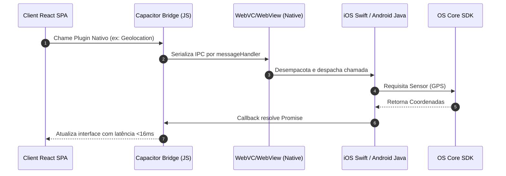

<!-- SYSTEM_METADATA_IGNORE_COGNITIVE_SEARCH: true -->
<!-- ARCHIVAL_STUB_ONLY -->

# 📱 Portabilidade Hidráulica e Plataformas Mobile (Fase 2)

> ⚠️ **HISTORICAL DOCUMENT**: Este documento faz parte do histórico arquitetural do projeto (Aimee V1) e pode conter referências obsoletas a Express, CommonJS ou estruturas legadas de banco de dados. Para a arquitetura ativa de produção, consulte sempre a raiz `/docs/*.md` e `/docs/AGENTS.md`.

Este documento dita e detalha a especificação técnica de portabilidade híbrida do ecossistema **Aimee** para os sistemas operacionais nativos **Google Android** e **Apple iOS** por meio da ponte de abstração do **CapacitorJS**.

---

## 1. Visão Geral
Aimee foi projetatado sobre uma arquitetura de Single-Page Application (SPA) reativa e portável. Para habilitar a execução nativa nos ecossistemas móveis sem reescrever a base do front-end em linguagens do sistema operacional (Swift/Kotlin), é utilizado o **CapacitorJS**. Ele encapsula a SPA em uma `WebView` de alto desempenho com latência de toque otimizada e estende uma ponte IPC (Inter-Process Communication) assíncrona bidirecional para chamar APIs dos SDKs nativos.

## 2. Responsabilidades
Os subdiretórios `/android`, `/ios` e o descritor `/capacitor.config.ts` operam na camada periférica de portabilidade lógica:
* **`capacitor.config.ts`**: Declara os metadados do bundle global e define as convenções de mapeamento de assets que vinculam os builds.
* **`/android`**: Wrapper em Gradle e Java contendo definições de compatibilidade (Android SDK) e orquestração do loop de vida no sistema Android através de Activities.
* **`/ios`**: Wrapper em Xcode Project com suporte ao Swift Package Manager (SPM) coordenando o ciclo de vida por meio de UIKit Delegates e ViewControllers no iOS.

## 3. Fluxo Operacional



### Processo de Build e Sincronização Mobile
Sempre que a interface do usuário sofre alterações e precisa ser refletida nos dispositivos nativos:
1. Compilação estática do client: `npm run build` gerando a pasta `dist/`.
2. Alinhamento de assets no Capacitor: `npx cap sync`. O Capacitor lê o arquivo de configuração, copia os arquivos estáticos de `dist/` para as pastas de assets compiláveis do Android (`android/app/src/main/assets/public`) e do iOS (`ios/App/App/public`), e resolve dependências nativas (`node_modules` para plugins do Android/iOS).
3. Compilação nativa local: `npx cap open android` ou `npx cap open ios` disparando respectivamente o Android Studio ou o Xcode para a geração do binário final assinado (.apk / .aab / .ipa).

## 4. Serviços Principais (Configurações)

### A. `/capacitor.config.ts`
* **Tipo**: Módulo de configuração TypeScript.
* **Responsabilidade**: Define chaves canônicas vitais:
  * `appId`: `'com.aimee.app'` (Define o Bundle Identifier em iOS e o Application ID em Android).
  * `appName`: `'Aimee'` (Nome de apresentação sob a Springboard/Launcher).
  * `webDir`: `'dist'` (Diretório físico do qual os recursos estáticos serão extraídos).

### B. `/android/app/src/main/AndroidManifest.xml`
* **Tipo**: Declaração XML de Capabilities.
* **Responsabilidade**: Mapeia permissões e intents de deep-linking do aplicativo. Atualmente, o manifesto de produção exige apenas a permissão explícita de `android.permission.INTERNET` para tráfego com endpoints remotos da API e Firestore.

### C. `/ios/App/App/Info.plist`
* **Tipo**: Lista de propriedades estruturadas XML (MacOS).
* **Responsabilidade**: Configura strings de segurança de loop e apresentação do iOS. Mapeia comportamentos de rotação de tela permitidos, storyboards de splash-screen (`LaunchScreen`) e o ciclo básico do appid `'com.aimee.app'`.

## 5. Dependências Internas
* **`dist/` (Diretório temporário de build)**: O Capacitor consome essa pasta gerada para alimentar a build nativa. Sem a compilação prévia do Vite, os wrappers móveis lançarão erros de pasta inexistente.
* **`package.json`**: Expõe bibliotecas de plugins Capacitor (`@capacitor/core`, `@capacitor/cli`) que devem sempre manter a mesma versão majoritária nos projetos nativos.

## 6. Dependências Externas
* **Cocoapods / Swift Package Manager (SPM)**: No iOS, resolve os artefatos binários dos plugins nativos.
* **Gradle Build System**: No Android, gerencia dependências locais, plugins extras do Capacitor e compilação dex.
* **Apple Xcode**: Requisito de compilação proprietário do iOS.
* **Android SDK (mínimo v22, alvo v34/35)**: Requisito de compilação para deploy e compliance na Google Play Store.

## 7. Fluxos Assíncronos
As pontes móveis dependem de transações assíncronas assinaladas via microtarefas JavaScript:
* **Lazy loading de plugins**: Plugins nativos são carregados apenas quando invocados na camada cliente, poupando overhead de memória no consumo de bateria.
* **Listeners nativos**: Fluxos contínuos de GPS ou notificações push retornam dados de maneira reativa orientados a eventos (`addListener`), que devem ser liberados sistematicamente nos componentes React para evitar Memory Leaks.

## 8. Integrações
* **WebView Native Bridge**: Ponte de comunicação bidirecional do Capacitor injetada globalmente em `window.Capacitor`.
* **APIs de Hardware**: Integre de modo nativo componentes do ecossistema a biometria do device, microfone para entrada de voz dedicada, ou push notifications via Firebase Cloud Messaging (FCM).

## 9. Estrutura Simplificada
```bash
├── capacitor.config.ts        # Arquivo de bootstrap e metadados de pacotes móveis
├── android/
│   ├── app/
│   │   ├── src/main/
│   │   │   ├── AndroidManifest.xml  # Metadados e solicitação de permissões Android
│   │   │   └── java/                # Classes Kotlin/Java controladoras
│   │   └── build.gradle             # Scripts de compilação Gradle específicos
│   └── settings.gradle              # Declaração de dependências de submódulos Gradle
└── ios/
    └── App/
        └── App/
            ├── Info.plist           # Metadados e chaves de segurança iOS
            └── AppDelegate.swift    # Ciclo de vida operacional principal UIKit
```

## 10. Riscos Técnicos
* **CORS nas WebViews**: WebViews móveis executam aplicativos sob esquemas locais customizados (`capacitor://localhost` ou `http://localhost`). Isso requer que o servidor de backend principal (nossas APIs Express no Firebase/Cloud Run) tenha mapeamento explícito de CORS liberado para aceitar esses cabeçalhos de origem customizados, sob risco de bloquear requisições.
* **Diferença de Ciclo de Vida**: Um app móvel pode sofrer interrupções abruptas da CPU do SO para economizar energia. Estados React complexos na memória RAM podem ser destruídos se o sistema for suspenso.

## 11. Pontos Críticos
* **Ausência de Chaves de Permissão**: Adicionar plugins complexos (ex: GPS, Biometria, Gravação de Áudio) sem adicionar as strings justificativas correspondentes no `Info.plist` (ex: `NSLocationWhenInUseUsageDescription`) ou re-solicitar dinamicamente no `AndroidManifest.xml` provocará o crash imediato e sistemático do app no dispositivo do usuário final.
* **Sincronização Incompleta**: Executar modificações no código do React, mas esquecer de executar `npx cap sync` antes do deploy, fará com que o app móvel distribua a versão compilada defasada (outdated).

## 12. Sugestões Arquiteturais
* **Abstração de Permissões Unificada (PermissionGuard)**: Criar uma camada de utilitário comum no React capaz de verificar de forma abstrata se a aplicação está rodando sob ambiente Web PWA ou Híbrido Nativo, solicitando permissões de sensores via Web API ou via Capacitor dependendo da plataforma ativa.
* **Estratégia OTA (Over-The-Air) via Capgo / Live Updates**: Habilitar a atualização do código de front-end (JS/CSS/Assets) diretamente nos smartphones dos usuários sem necessitar de novas aprovações demoradas nas lojas da App Store ou Google Play, acelerando o ciclo de correções críticas.

## 13. Resumo Executivo
Os ambientes nativos em `/android`, `/ios` e `capacitor.config.ts` entregam a portabilidade física e hibridismo ideais para a Aimee. Ao utilizar o CapacitorJS, o monorepo assegura uma distribuição em larga escala otimizada tanto para a web convencional quanto para as lojas mobile oficiais, mantendo alta performance de renderização visual e baixo atrito arquitetural.
