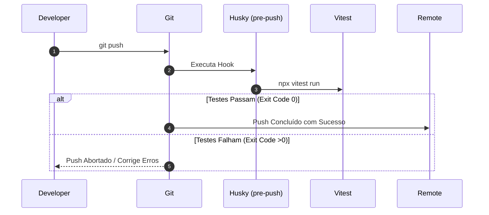

# 🚀 Automação de Pipelines & Hooks Locais (Fase 1)

Este documento analisa em detalhes a infraestrutura de automação local, consistência de imports e sincronização de ecossistema e ambientes contidos em `.husky/` e `/scripts/` na raiz do projeto.

---

## 1. Visão Geral
A pipeline local da Aimee foi concebida para fornecer um fluxo de verificação de qualidade rigoroso, build paralelo altamente eficiente, e utilitários automatizados para ajuste retroativo de importações quebradas assim como sincronia de variáveis de ambientes públicos para o hosting de produção (Vercel).

## 2. Responsabilidades
A camada de automação é dividida em dois eixos funcionais principais:
* **Garantia de Qualidade Pré-Push (Git Hooks)**: Interceptar operações de push do desenvolvedor para rodar as suítes de teste de forma obrigatória antes de enviar commits ao repositório remoto.
* **Orquestração e Build Utilitário (Scripts)**: Permitir compilações ultrarrápidas em paralelo de cliente e servidor, regularizar caminhos de importação após refatorações estruturais do domínio e prover mapeamentos de variáveis de ambiente do Kubernetes-like ConfigMap locais até o Vercel CLI.

## 3. Fluxo Operacional



### Operação do Orquestrador de Build (`build-orch.js`)
Quando o comando de build principal é executado (`npm run build` ou similar):
1. O script detecta a flag de ambiente para pular testes (`SKIP_TESTS` ou `SKIP_BUILD_TESTS`).
2. Ele inicia simultaneamente em threads separadas via Process Spawning:
   - Compilação do cliente Vite (`npm run build:client`).
   - Compilação do servidor baseada em esbuild (`npm run build:server`).
   - Execução das suítes de testes (`npm run test`), se não puladas.
3. Consolida de forma inteligente o buffer de log (`stdout` e `stderr`) filtrando avisos benignos de compiladores e diferenciando de falhas operacionais reais baseadas em RegExp.
4. Completa com sucesso se todas as promises forem bem-sucedidas.

## 4. Serviços Principais (Descrição dos Scripts)

### A. `.husky/pre-push`
* **Tipo**: Git Hook script.
* **Propósito**: Executa `npx vitest run` imediatamente antes de enviar código para ramos remotos. Previne a entrada de bugs que gerem regressão no core determinístico do projeto.

### B. `scripts/build-orch.js`
* **Tipo**: Orquestrador inteligente de processos Node.js.
* **Propósito**: Executa paralelismo de build (Client + Server + Tests). Otimiza o tempo de compilação em esteiras lógicas e localmente usando manipulação assíncrona de processos filhos com controle preciso de buffers.

### C. `scripts/fix-imports.ts`
* **Tipo**: Script corretivo de AST / Regex de arquivos.
* **Propósito**: Corrige retroativamente caminhos de importação do domínio legado (ex: `domain/validation/schemas` para `../models/index.js`). Garante integridade de imports ESModules e resolve quebras de tipos após centralizações.

### D. `scripts/sync-env.ts`
* **Tipo**: Sincronizador de ambientes declarativo (ConfigMap).
* **Propósito**: Lê o arquivo `config-map.yaml` e gera no console os comandos Vercel CLI necessários para declarar ou forçar (`--force`) as chaves públicas nos ambientes de `production` e `preview`.

### E. `scripts/sync-vercel-env.sh`
* **Tipo**: Script Bash (Shell).
* **Propósito**: Automatiza o preenchimento de variáveis de ambiente estáticas do Firebase e URLs de ambiente do projeto da Aimee utilizando chamadas de comando utilitário Vercel CLI.

## 5. Dependências Internas
* **`config-map.yaml`**: Utilizado como fonte de dados declarativa pelo script `sync-env.ts`.
* **`src/`**: Alvo principal de busca e substituição léxica por Regex em `fix-imports.ts`.
* **`package.json`**: Fornece os scripts de gatilho real (`npm run build:client`, `npm run build:server`, `npm run test`) chamados pelo `build-orch.js`.

## 6. Dependências Externas
* **`child_process` (módulo nativo Node.js)**: Utiliza `spawn` para paralelizar fluxos em processos de OS apartados.
* **`js-yaml`**: Parser externo essencial para viabilizar a leitura e estruturação de dados do YAML em `sync-env.ts`.
* **`vitest`**: Engine de testes responsável pela validação do ambiente.
* **`vercel` (CLI)**: Utilizado como oráculo receptor de parâmetros nos scripts de sincronia de ambiente.

## 7. Fluxos Assíncronos
Os fluxos assíncronos em `build-orch.js` utilizam uma estrutura robusta de orquestração de promises:
* **Spawn de Paralelismo Máximo**: `Promise.all([clientBuild, serverBuild, testsRun])`.
* **Controle de Interface**: Captura fragmentada dos logs através de `stdout.on('data')` e `stderr.on('data')`, reconstruindo as strings por quebra de linha `\n` antes de exibir no terminal.

## 8. Integrações
* **Firebase & Vercel**: Realizada por meio da exportação de variáveis sensíveis e públicas (VITE_FIREBASE_PROJECT_ID, VITE_FIREBASE_DATABASE_ID, etc.) usadas no bootstrap e lidas dinamicamente pela infraestrutura de client do projeto.

## 9. Estrutura Simplificada
```bash
├── .husky/
│   └── pre-push               # Git Hook executável pré-push (Vitest)
└── scripts/
    ├── build-orch.js          # Compilador/Orquestrador paralelo concorrente (Node.js)
    ├── fix-imports.ts         # Varredor de correção de caminhos de arquivos TypeScript
    ├── sync-env.ts            # Parser YAML de variáveis locais para comandos Vercel CLI
    └── sync-vercel-env.sh     # Bash script injetor de configurações Firebase públicas
```

## 10. Riscos Técnicos
* **Deprecation Warning DEP0190**: O uso inadequado do `child_process.spawn` nativo em sistemas operacionais baseados em Windows contornando o interpretador global `.cmd` sem passar flags corretivas pode travar subprocessos. O `build-orch.js` neutraliza esse comportamento tratando `process.platform === 'win32'` de forma declarativa limpando os gatilhos npm.
* **Divergência de Ambientes**: Em caso de modificações locais no `config-map.yaml`, variáveis críticas podem ficar defasadas no console da Vercel se o engenheiro esquecer de executar o sincronizador.

## 11. Pontos Críticos
* **Buffer residual pós-fechamento**: Em execuções assíncronas muito rápidas, o stream de saída de dados pode encerrar sem realizar o flush completo dos buffers de stdout e stderr. O `build-orch.js` implementa um padrão de segurança realizando flush manual das variáveis residuais no listener `close` do processo.
* **Validação léxica rígida**: O script `fix-imports.ts` utiliza Regex que assume uma certa estrutura de pastas. Modificações pesadas de profundidade de subpastas sem reconfigurar o Regex podem falhar em identificar arquivos recursivos.

## 12. Sugestões Arquiteturais
* **Geração Automática de .env**: Integrar o `sync-env.ts` para que, além de gerar comandos no terminal, ele gere automaticamente um arquivo local `.env` atualizado (baseado no `.env.example`), removendo etapas manuais de onboarding de desenvolvedores.
* **Adoção de Turborepo ou Nx**: À medida que os pacotes do monorepo crescem para acomodar mais extensões (ex: funções serverless sob `/api` e adaptadores móveis nativos), substituir o orquestrador manual `build-orch.js` por um gerenciador de cache incremental robusto trará grandes ganhos a longo prazo.

## 13. Resumo Executivo
A infraestrutura de desenvolvimento e automação local em `.husky/` e `/scripts/` cria uma esteira local protetiva excelente, promovendo testes obrigatórios antes de qualquer pushing remoto e otimizando o pipeline de build unificado através de paralelismo assíncrono avançado. É uma arquitetura de esteira moderna e altamente resiliente.
