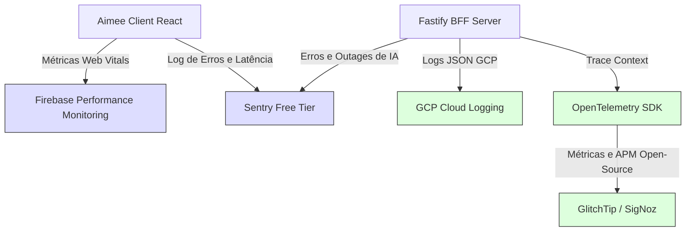

# 📋 Relatório de Avaliação Macro e Maturidade Sistêmica
**Projeto:** Aimee (Personal AI Agent Orchestrator)
**Autor:** Jules (Cognitive Software Engineer Agent)
**Status:** Versão 1.0 (Analítico e Baseado em Evidências)
**Data:** Fevereiro de 2025

<- Voltar para o portal: [[AGENTS.md]]

---

## 🎯 1. Introdução e Objetivo

Este documento apresenta uma **avaliação macro e diagnóstico de maturidade** do projeto **Aimee**, analisando detalhadamente a arquitetura do monorepo (React SPA + Fastify BFF + Firestore), a camada de orquestração de IA e as práticas de engenharia de software implementadas.

O diagnóstico é estruturado de forma **estritamente baseada em evidências**, extraindo referências do código-fonte real e contrapondo-as às práticas consolidadas de grandes players de tecnologia (Vercel, Supabase, LangChain, Netflix, GCP e Sentry). O foco principal é mapear o estado atual (**AS-IS**) e desenhar uma visão de futuro tática (**TO-BE**) com soluções prioritariamente open-source ou com planos gratuitos generosos (*zero cost* para desenvolvimento e validação).

---

## 📊 2. Sumário Executivo de Maturidade

Abaixo, cada dimensão técnica é avaliada em uma escala de **1 a 5** (onde 1 é Inicial/Ausente e 5 é Otimizado/Classe Mundial).

| Dimensão | Score | Nível de Maturidade | Principal Evidência | Próximo Salto de Evolução |
| :--- | :---: | :--- | :--- | :--- |
| **Resiliência** | **3.8** | Definido / Reativo | `retryUtils.ts` (Exponential Backoff), `AimeeOrchestrator.ts` (Multi-provider fallback). | Circuit Breaker em chamadas externas e tratamento inteligente de timeouts por provedor. |
| **Tratamento de Erros** | **4.2** | Gerenciado | `errorMapper.ts` (unificação de erros Firebase/gRPC), `globalErrorHandler` no Fastify. | Integração de erros do BFF com o Client React por meio de códigos semânticos. |
| **Rastreabilidade** | **2.5** | Inicial / Fragmentado | `traceId` gerado aleatoriamente no `logger.ts` sem propagação de contexto HTTP ou DB. | Propagação de W3C Trace Context headers e OpenTelemetry (Context Propagation). |
| **Observabilidade** | **2.0** | Inicial | Sem APM, métricas de hardware/software, ou auditoria em tempo real além de logs em arquivo/console. | Integração de APM open-source (Signoz, GlitchTip) ou Firebase Performance/Sentry (Tier Free). |
| **Logging Estruturado** | **4.5** | Otimizado | `logger.ts` gerando JSON compatível com o Google Cloud Logging Standard. | Padronização total de logs no Client (React) usando o mesmo contrato de severidade. |
| **Performance** | **4.0** | Gerenciado / Otimizado | `LRUCache` no `AimeeOrchestrator.ts`, Lazy Loading para Serverless, Bundles rápidos via `esbuild`. | Edge Caching via Cloudflare/Vercel e compressão Gzip/Brotli ativa no BFF. |
| **Boas Práticas & Arq.** | **4.2** | Otimizado | Inversão de Controle com `tsyringe`, DDD (Skills), Clean Architecture e Validação com Zod (SSOT). | Resolver o desalinhamento arquitetural (Repositories e Skills instanciados como constantes globais). |
| **Duplicação de Código** | **4.5** | Otimizado | Tipagem TypeScript inferida diretamente de Schemas Zod (`src/models/index.ts`). | Unificação de tipos parciais de persistência e expurgo final de esquemas redundantes legados. |
| **Bugs Ativos** | **4.5** | Gerenciado | Sem erros críticos aparentes de runtime; regras de negócios isoladas e cobertas por testes unitários. | Correção de riscos de concorrência e batch limits do Firestore (limite de 500 escritas). |
| **Coverage (Testes)** | **2.0** | Crítico | Coverage global em **18.7%** devido à falta de testes de integração e componentes visuais (React). | Configuração de exclusão de arquivos de UI/Config no Vitest e mocks automatizados do Firestore. |

---

## 🔍 3. Diagnóstico Profundo por Dimensão

---

### 🛡️ 3.1. Resiliência (Maturidade: 3.8/5.0)

#### 📝 Evidências no Código Atual
O projeto possui soluções inteligentes de resiliência implementadas em pontos críticos de integração:
1. **Exponential Backoff**: O helper `src/lib/retryUtils.ts` implementa uma lógica genérica com fator multiplicativo (`backoffFactor`) e atrasos progressivos para contornar falhas intermitentes de rede ou limite de requisições.
2. **Multi-Model Fallback**: Em `AimeeOrchestrator.ts` (linhas 110-155), se um provedor de IA falhar (ex: `gemini`), o sistema captura o erro e realiza fallback transparente e ordenado para outros provedores configurados (`deepseek`, e depois `openai`).
3. **Multi-Model Fallback com Grounding e Backup**: A `EventDiscoverySkill.ts` implementa uma cascata robusta de busca em tempo real com barramento redundante, retornando uma lista local estática e segura em último caso de indisponibilidade geral.

#### 🏛️ Benchmark com Grandes Players
Players de orquestração de IA (como LangChain, LlamaIndex ou a infraestrutura interna da Netflix) usam padrões avançados de resiliência como:
* **Circuit Breaker**: Se um serviço de IA externa falhar de forma recorrente (ex: erro 503 por 10 chamadas seguidas), o Circuit Breaker abre, impedindo requisições de irem para a rede e gerando respostas padrão locais de imediato, economizando tempo de timeout e banda.
* **Rate Limit Reativo**: Leitura de cabeçalhos de resposta (como `x-ratelimit-remaining` ou `Retry-After`) para pausar chamadas ou recalibrar o backoff dinamicamente com base nas respostas dos servidores da OpenAI/Gemini.

#### 🚀 Oportunidades de Evolução (TO-BE)
1. **Implementar Circuit Breakers (Zero Custo / Open-Source)**:
   * **Tecnologia**: Adoção do pacote open-source leve `@posquit0/capacitor-circuit-breaker` ou implementação de um Circuit Breaker interno simplificado no `AimeeOrchestrator`.
   * **Como funciona**: Evita desgastar quotas e segurar requisições HTTP travadas (timeouts longos) se a API do Gemini ou DeepSeek estiver comprovadamente offline (Outage).
2. **Backoff Dinâmico Orientado a Headers**:
   * Ajustar o `retryUtils` para ler cabeçalhos HTTP do tipo `Retry-After` enviados pelos provedores e respeitar o limite exato solicitado pelas plataformas.

---

### 🛑 3.2. Tratamento de Erros (Maturidade: 4.2/5.0)

#### 📝 Evidências no Código Atual
O tratamento de erros técnicos e infraestruturais é excelente no backend:
1. **Mapeamento de Erros de Infraestrutura**: Em `src/lib/errorMapper.ts`, o sistema intercepta de forma brilhante códigos de erros gRPC/Firestore (como permissão negada, timeouts, estouro de quota, problemas de resolução DNS) e gera:
   * Uma mensagem amigável para o usuário (`friendlyMessage`).
   * Um código interno limpo (`PERMISSION_DENIED`, `DEADLINE_EXCEEDED`, etc).
   * Uma dica acionável de remediação (`remediation`) para o desenvolvedor.
2. **Fastify Error Handler Central**: O middleware `globalErrorHandler` em `src/server/middlewares.ts` garante que qualquer exceção não capturada resulte em um JSON estruturado com HTTP Status Code semântico (400, 500, etc), sem vazar stacks confidenciais em produção.

```typescript
// Evidência do mapeamento de erro estruturado em errorMapper.ts
export function mapInfrastructureError(error: any, operation: string, path?: string): MappedError {
  // ...
  if (combinedString.includes('permission_denied') || errorCode === 'permission-denied') {
    code = 'PERMISSION_DENIED';
    friendlyMessage = 'Permissão negada ou privilégios insuficientes para realizar esta operação.';
    remediation = 'Verifique se as Regras de Segurança do Firestore permitem essa ação...';
  }
  // ...
}
```

#### 🏛️ Benchmark com Grandes Players
Provedores de Backend modernizados (como Supabase e Vercel) expõem respostas de erros acopladas a códigos de diagnóstico padronizados (similar ao padrão RFC 7807 - "Problem Details for HTTP APIs"), permitindo que o cliente frontend reaja de forma automatizada ao erro.

#### 🚀 Oportunidades de Evolução (TO-BE)
1. **Padrão RFC 7807 (Problem Details)**:
   * Ajustar a saída do `globalErrorHandler` para seguir estritamente o padrão RFC 7807, permitindo que o cliente React SPA processe de forma genérica erros transacionais e exiba popups contextualizados (toasts) baseados nos códigos de remediação.
2. **Erros de Validação Amigáveis na UI**:
   * Atualmente, se um formulário no frontend falha no Zod do backend, o Fastify retorna um HTTP 400 com os caminhos brutos das variáveis (`details: [{ path, message }]`).
   * **Evolução**: Traduzir os nomes dos campos para português de forma automatizada antes do envio ao cliente (ex: transformar `amount` em `Valor` e `type` em `Tipo`).

---

### 🔗 3.3. Rastreabilidade (Maturidade: 2.5/5.0)

#### 📝 Evidências no Código Atual
O sistema ensaia um mecanismo de rastreabilidade, mas ele é estático e local:
1. No `src/lib/logger.ts`, o método `generateTraceId()` cria um ID pseudo-aleatório baseado em matemática de string (`Math.random().toString(36)...`).
2. No entanto, esse `traceId` **não é propagado** em transações do Firestore, nem é transmitido do cliente React para o servidor BFF Fastify. Cada registro de log isolado ganha um traceID que morre na mesma linha de instrução, quebrando a capacidade de ligar uma ação da UI a uma query no banco de dados.

#### 🏛️ Benchmark com Grandes Players
Classe mundial de microserviços e BFFs (Sentry, Uber, Datadog) adota a especificação de rastreamento distribuído **W3C Trace Context** (`traceparent`). O ID da transação inicia no browser do usuário, trafega nos cabeçalhos HTTP (`traceparent`), é assimilado pelo servidor BFF e anexado às queries enviadas ao banco de dados ou provedores de IA.

#### 🚀 Oportunidades de Evolução (TO-BE)
1. **Propagação de Contexto W3C (Trace Context - Zero Cost)**:
   * **Implementação**: Adicionar um middleware simples no Fastify que extrai o cabeçalho `traceparent` (ou um customizado como `x-trace-id`) enviado pelo cliente Web.
   * Se ausente, o servidor gera. Esse ID passa a ser compartilhado por todos os logs daquela requisição.
2. **Log de Sessão Conversacional**:
   * Vincular o `traceId` das requisições de IA diretamente ao documento do `ChatRepository` e ao `UsageRepository` no Firestore, permitindo auditar o caminho exato de tokens gerados a partir de um clique de chat específico de um usuário.

---

### 👁️ 3.4. Observabilidade (Maturidade: 2.0/5.0)

#### 📝 Evidências no Código Atual
Não há ferramentas de APM (Application Performance Monitoring) ou coleta de métricas instaladas. O projeto depende inteiramente da leitura reativa de logs escritos em tela ou salvos no servidor de hospedagem. Se um endpoint de IA demorar 15 segundos para responder, ou se o Firestore sofrer latência, não há alertas automáticos ou métricas históricas de performance coletadas.

#### 🏛️ Benchmark com Grandes Players
Ambientes de produção robustos usam métricas e telemetria ativas para prever indisponibilidades. Elas respondem perguntas como: *Qual é a latência do p95 de nossas requisições de IA? Quantas requisições resultaram em HTTP 500 nos últimos 10 minutos?*

#### 🚀 Oportunidades de Evolução (TO-BE)
Para manter o projeto **zero custo**, sugerimos soluções com planos gratuitos robustos:
1. **Sentry (Tier Gratuito Generoso)**:
   * Excelente para capturar erros não tratados no frontend (React) e backend (Fastify) em tempo real, gerando relatórios de stack traces, sessões de usuários atingidas, e métricas de Web Vitals.
2. **OpenTelemetry + Signoz / GlitchTip (Open-Source)**:
   * Ferramentas open-source auto-hospedadas (ou com tiers gratuitos em nuvem) que assimilam rastreamento distribuído sem taxas pesadas de licenciamento corporativo (como Datadog ou New Relic).
3. **Métricas de Performance do Firebase (Firebase Performance Monitoring)**:
   * **Custo Zero**: Ativar o SDK do Firebase Performance no cliente React. Ele mede automaticamente tempos de renderização de telas, latência de chamadas HTTP feitas para a API BFF Fastify e performance de carregamento de recursos.

---

### 📝 3.5. Logging Estruturado (Maturidade: 4.5/5.0)

#### 📝 Evidências no Código Atual
Esta é uma das dimensões mais maduras e bem desenvolvidas do projeto:
1. **JSON Standard para Cloud Logging**: O `src/lib/logger.ts` identifica automaticamente o ambiente. Em produção, ele desativa saídas formatadas coloridas de terminal e gera logs em **JSON estruturado de linha única**.
2. **Severity Mapping**: O log mapeia a chave `severity` em letras maiúsculas (`INFO`, `WARN`, `ERROR`), atendendo estritamente à especificação estruturada de ingestão do Google Cloud Logging (Stackdriver).
3. **Tratamento de Erros**: O logger possui um serializador nativo excelente que desestrutura instâncias de `Error`, extraindo de forma limpa `message`, `stack` e `name` sem quebrar o formato JSON.

```typescript
// Evidência de design estruturado para GCP em logger.ts
const fullEntry: any = {
  severity: entry.level.toUpperCase(), // Google Cloud standard
  level: entry.level,
  message: entry.message,
  timestamp: new Date().toISOString(),
  traceId: entry.traceId || this.generateTraceId(),
  userId: entry.userId,
  ...context
};
```

#### 🏛️ Benchmark com Grandes Players
Seguindo as melhores diretrizes de Cloud-Native de players como GCP e AWS, o log estruturado em JSON permite criar dashboards analíticos e alertas de segurança instantâneos sem precisar de analisadores complexos de texto bruto (Regex).

#### 🚀 Oportunidades de Evolução (TO-BE)
1. **Unificação de Contrato de Logs (BFF -> Client)**:
   * Criar um helper leve de logging no Client React que envie logs críticos de erros de interface para um endpoint dedicado do BFF (`POST /api/logs/client`), permitindo centralizar a auditoria de bugs visuais na mesma console do servidor.
2. **Remover chaves não serializáveis**:
   * Apesar de existir um `try/catch` no `JSON.stringify` do logger, adicionar um validador/limpador recursivo que evite referências circulares em objetos de contexto complexos injetados por engano.

---

### ⚡ 3.6. Performance (Maturidade: 4.0/5.0)

#### 📝 Evidências no Código Atual
O projeto demonstra fortes preocupações com performance em canais de alto custo e latência:
1. **Caching de IA**: O `AimeeOrchestrator.ts` usa uma instância de `LRUCache` (armazenando até 100 itens por 5 minutos) para responder de forma instantânea (latência < 5ms) perguntas repetitivas ou comuns que não necessitam de chamadas ao provedor de IA generativa.
2. **Lazy Loading de Boot (Serverless Cold Start Optimization)**: Para mitigar os cold starts da Vercel Edge, as rotas do Fastify evitam instanciar de imediato conexões pesadas, carregando dinamicamente módulos somente sob demanda e mantendo o boot síncrono ultra-rápido.
3. **Transpilação de Alta Velocidade**: O uso de `esbuild` no script `build:server` garante que o backend seja empacotado em milissegundos em um bundle único otimizado em ES Modules.

#### 🏛️ Benchmark com Grandes Players
Aplicações SPA que necessitam de escala de borda (Edge) descentralizam respostas usando CDN-edge-caching e controlando tempos de cache HTTP (cabeçalhos `Cache-Control` e mecanismos de SWR - *Stale While Revalidate*).

#### 🚀 Oportunidades de Evolução (TO-BE)
1. **Compressão de Payloads (Gzip / Brotli)**:
   * **Evolução**: Ativar o pacote `@fastify/compress` no Fastify. Isso reduzirá o tamanho das respostas JSON transacionais do BFF (como listas longas de compras ou históricos de transações financeiras), otimizando a velocidade de rede em conexões móveis limitadas (3G/4G).
2. **Caching de Leitura do Firestore (Offline Persistence)**:
   * Ativar o mecanismo de persistência offline nativo do Firebase Web SDK no Client. Isso permite que a UI do React carregue dados instantaneamente a partir do cache local do navegador/dispositivo móvel, sincronizando alterações em background com o Firestore em tempo de execução.

---

### 🏗️ 3.7. Boas Práticas & Arquitetura (Maturidade: 4.2/5.0)

#### 📝 Evidências no Código Atual
O projeto é estruturado de forma impecável sob padrões de **Clean Architecture** e **Hexagonal (Ports and Adapters)**:
1. **Domain Isolation**: A pasta `src/domain` é limpa de dependências físicas de bancos de dados ou frameworks de tela. Toda a inteligência contábil, comportamental ou de agendamento é expressa via **Skills** puras (`FinanceSkill`, `RoutineSkill`, `ShoppingSkill`).
2. **Validação Determinística**: Uso de Schemas Zod em `src/models/index.ts` atuando como a única fonte da verdade, eliminando redundâncias.
3. **Inversão de Controle**: Utilização de `tsyringe` para injeção de dependências no servidor Fastify.
4. **Drift Arquitetural Identificado**: Embora o `AimeeOrchestrator` e o `EmailService` usem os decoradores `@singleton()` e injeção do tsyringe, a maioria dos **Repositories** (ex: `TransactionRepository`) e das **Skills** ainda é instanciada e exportada manualmente como constantes globais. Isso representa um desvio técnico da convenção de DI planejada.

#### 🏛️ Benchmark com Grandes Players
Arquiteturas corporativas robustas de grandes players impõem limites estritos contra desvios arquiteturais (Drifts). A injeção de dependência deve ser consistente em todas as camadas para facilitar testes unitários simulados (mocking) sem depender de importações globais mutáveis.

#### 🚀 Oportunidades de Evolução (TO-BE)
1. **Sanar o DI Drift (Injeção Consistente)**:
   * Refatorar os Repositórios e Skills para utilizarem os decoradores `@injectable()` e `@singleton()` do `tsyringe`, permitindo que o `container.ts` seja o único ponto de resolução do grafo de dependências do backend.
2. **Segregar Rotas e Controladores (Controllers)**:
   * Atualmente, o arquivo `src/server/routes.ts` possui centenas de linhas contendo tanto as definições HTTP das rotas quanto a lógica de tratamento das requisições.
   * **Evolução**: Separar em classes controladoras (ex: `FinanceController`, `ChatController`), injetando os serviços e repositórios necessários de forma limpa.

---

### ✂️ 3.8. Duplicação de Código (Maturidade: 4.5/5.0)

#### 📝 Evidências no Código Atual
A duplicação de código é extremamente baixa graças às seguintes táticas de design:
1. **TypeScript Types inferidos do Zod**: Não há declarações manuais redundantes de interfaces TypeScript paralelas para os modelos de dados. Elas utilizam `z.infer<typeof Schema>` a partir do arquivo único de verdade (`src/models/index.ts`).
2. **Herança do BaseRepository**: Todas as coleções Firestore herdam o CRUD genérico de `BaseRepository.ts`, herdando higienização de dados, tratamento de nulos, timestamps automáticos e isolamento de inquilino (Tenant Isolation) com reaproveitamento de código de quase 100%.

#### 🏛️ Benchmark com Grandes Players
Aplicações Monorepo de ponta utilizam ferramentas de análise estática (como SonarQube ou ESLint com plugins de detecção de similaridade de código) para bloquear PRs que introduzam blocos duplicados de código acima de limites estritos.

#### 🚀 Oportunidades de Evolução (TO-BE)
1. **Consolidar Schemas Legados de Validação**:
   * Identificar se ainda há arquivos residuais como `src/domain/validation/schemas.ts` que possam gerar confusão ou importações errôneas, consolidando toda a validação em `src/models/index.ts`.
2. **Compartilhar Helpers de String/Data**:
   * Unificar funções utilitárias de tratamento de datas do calendário que estejam levemente duplicadas entre helpers do cliente (`client/`) e as Skills do domínio (`domain/`).

---

### 🐛 3.9. Bugs Ativos & Riscos de Runtime (Maturidade: 4.5/5.0)

#### 📝 Evidências no Código Atual
Não foram identificados bugs ativos óbvios ou falhas críticas de execução imediata. O código demonstra maturidade na sanitização de dados:
* **Sanitização de Nulos**: O método `sanitizeData` em `BaseRepository.ts` remove preventivamente chaves que contenham valores `undefined` antes da gravação no Firestore, evitando quebras fatais do SDK nativo.
* **Batch Slicing**: O repositório `MonitorEventRepository` prevê o limite absoluto de 500 gravações em lote do Firestore e fatia de forma automatizada lotes em sub-grupos de 100 gravações simultâneas.

#### 🏛️ Benchmark com Grandes Players
Sistemas NoSQL robustos possuem salvaguardas explícitas contra concorrência e condições de corrida (*race conditions*), especialmente em escritas repetitivas sobre saldos financeiros ou atualização de status.

#### 🚀 Oportunidades de Evolução (TO-BE)
1. **Transações do Firestore em Balanços Contábeis**:
   * Se dois familiares atualizarem itens financeiros simultaneamente, pode ocorrer uma condição de corrida caso o saldo seja recalculado fora do banco.
   * **Evolução**: Utilizar transações nativas do Firestore (`runTransaction`) para atualizações cumulativas de saldos agregados ou contadores de gamificação de XP.

---

### 🧪 3.10. Coverage e Testes (Maturidade: 2.0/5.0)

#### 📝 Evidências no Código Atual
Esta é a **área mais crítica e prioritária para intervenção técnica** no projeto:
1. **Média Geral de Cobertura Baixa (18.7%)**: A execução do script de cobertura de código (`pnpm coverage` com Vitest v8) falha de forma ruidosa, pois não atinge o threshold corporativo mínimo exigido (80%).
2. **Motivo Real**:
   * O Vitest está configurado para calcular cobertura sobre **todos** os arquivos da árvore de fontes, incluindo as views pesadas do React (`ChatView.tsx`, `FinanceView.tsx` com mais de 700 linhas cada), controladores de rotas, middlewares, e arquivos de configuração.
   * Como essas views e rotas de infraestrutura contêm forte lógica visual e acoplamento direto de renderização SPA sem testes de integração (Cypress/Playwright) escritos, a média global de cobertura de código despenca.
3. **Maturidade Isolada no Domínio**: A camada de regras de negócio puras (como `RoutineSkill.test.ts`, `FinanceSkill.test.ts`, `ValidationService.test.ts`) possui cobertura alta e saudável, demonstrando que as decisões matemáticas de negócio estão bem testadas.

#### 🏛️ Benchmark com Grandes Players
Equipes de engenharia eficientes configuram o motor de testes (como Jest ou Vitest) com políticas de exclusão cirúrgicas. Arquivos como views de UI, testes propriamente ditos, arquivos de declaração de tipos (`.d.ts`), scripts de build e configurações globais do servidor são excluídos da contabilidade do threshold de cobertura. O foco de 80% ou 90% é direcionado à camada de **domínio, lógica de negócios, utilitários, validadores de schemas e serviços**.

#### 🚀 Oportunidades de Evolução (TO-BE)
1. **Refatoração Tática da Configuração do Vitest**:
   * Ajustar o arquivo de configuração do Vitest (`vite.config.ts`) ou adicionar regras no `package.json` para ignorar caminhos irrelevantes para testes unitários no cálculo do coverage.
   * **Excluir**: `src/client/pages/**`, `src/client/components/**`, `src/server/firebaseAdmin.ts`, `src/server/routes.ts`, etc.
   * **Focar**: `src/domain/**`, `src/lib/**`, `src/models/**`.
2. **Adotar Mocks Inteligentes do Firebase**:
   * Criar mocks automatizados para as chamadas do Firebase Admin SDK nos testes unitários, permitindo testar repositórios sem a necessidade de instanciar credenciais reais ou simular conexões com a nuvem Google.

---

## 🔮 4. Oportunidades de Evolução e Adoção de Tecnologias

Abaixo, apresentamos uma curadoria de tecnologias e fluxos aderentes ao projeto da Aimee, priorizando ferramentas com **tiers gratuitos generosos** ou **open-source**, alinhadas às práticas dos maiores players de mercado.



### 1. Observabilidade Unificada (Sentry)
* **O que é**: Plataforma líder em monitoramento de erros e diagnóstico de performance.
* **Aderência ao projeto**: Oferece um plano gratuito generoso que cobre até 5.000 eventos/mês. Pode ser integrado tanto no frontend React SPA quanto no backend Fastify.
* **Benefício**: Notificação imediata de exceções de IA, falhas de autenticação do Google OAuth e erros visuais no navegador do usuário.

### 2. Monitoramento de Performance Nativo (Firebase Performance Monitoring)
* **O que é**: SDK nativo do ecossistema Firebase para monitoramento de performance.
* **Aderência ao projeto**: **100% gratuito** e já disponível no painel do Firebase ativo do projeto.
* **Benefício**: Coleta passiva de métricas de rede (tempo de resposta de chamadas à `/api/ai`), tempos de renderização de telas complexas (como o `FinanceView`) e taxas de sucesso HTTP de forma instantânea, sem onerar custos.

### 3. Gateway de Cache de IA Inteligente (Portkey / LiteLLM - Open-Source)
* **O que é**: Proxies de borda de IA open-source focados em resiliência, fallback, balanceamento de carga e caching de tokens de prompts.
* **Aderência ao projeto**: Substitui o caching manual do orquestrador e gerencia de forma polimórfica chaves de API, limites de cota e falhas com uma interface administrativa integrada.
* **Benefício**: Centralização do faturamento de tokens e troca dinâmica de provedores em runtime sem precisar mexer em código do BFF.

### 4. Circuit Breakers leves com `@posquit0/capacitor-circuit-breaker`
* **O que é**: Uma biblioteca open-source extremamente leve em TypeScript para implementar o padrão de Circuit Breaker.
* **Aderência ao projeto**: Pode envelopar as chamadas feitas aos adapters do Gemini e DeepSeek em `AimeeOrchestrator.ts`.
* **Benefício**: Se a API da OpenAI estiver lenta ou fora do ar, o sistema corta chamadas de rede imediatamente, preservando a experiência conversacional do usuário com uma resposta rápida e amigável local.

---

## 📌 5. Conclusão e Próximos Passos Recomendados

O projeto **Aimee** demonstra uma maturidade arquitetural invejável. A decisão de isolar as regras de negócio em **Skills do Domínio** puras e inferir tipos diretamente a partir de **Schemas Zod** (Single Source of Truth) aproxima o ecossistema das melhores práticas de engenharia de software de classe mundial.

A maior fragilidade do projeto reside na **infraestrutura de validação de qualidade (Coverage)** e na **rastreabilidade distribuída de logs**.

Como próximos passos táticos para a evolução técnica saudável da Aimee, sugerimos a seguinte trilha de prioridades:

1. **Fase 1 (Qualidade & Pipeline)**: Ajustar a parametrização de exclusões do Vitest para que o threshold de 80% de cobertura reflita apenas a camada de inteligência e domínio, destravando a esteira de builds e automações CI/CD do monorepo de forma saudável.
2. **Fase 2 (Observabilidade & Erros)**: Ativar o Sentry (Free Tier) e o Firebase Performance Monitoring para obter diagnósticos reais de latência e quebras de runtime do BFF em produção.
3. **Fase 3 (Refatoração de Injeção de Dependências)**: Eliminar o desvio arquitetural (*DI Drift*) unificando a inicialização de Repositórios e Skills dentro do container do `tsyringe`.
