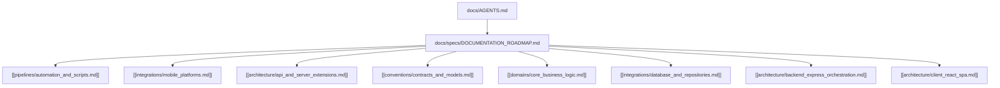

# 🗺️ Plano de Cobertura Documental Incremental

Este documento estabelece o roadmap oficial para mapear, classificar e registrar de forma perene cada módulo, diretório e infraestrutura do ecossistema **Aimee**. Projetado para servir como a memória persistente ideal para engenheiros de software e agentes cognitivos de IA.

---

## 📈 Indicador de Cobertura de Documentação (Métricas)

| Módulo/Estrutura | Tipo / Escopo | Arquivo de Destino | Status | Peso no Projeto |
| :--- | :--- | :--- | :--- | :--- |
| **Ponto de Entrada** | Bootstrap Geral | `[[AGENTS.md]]` | ✅ **Concluído** | 5% |
| **Fase 1: Automação & Hooks** | `.husky/` & `scripts/` | `[[pipelines/automation_and_scripts.md]]` | ✅ **Concluído** | 10% |
| **Fase 2: Plataformas Mobile** | `android/` & `ios/` | `[[integrations/mobile_platforms.md]]` | ✅ **Concluído** | 10% |
| **Fase 3: Cloud & Extensões** | `api/` & `dist-server/` & `public/` | `[[architecture/api_and_server_extensions.md]]` | ✅ **Concluído** | 10% |
| **Fase 4: Contratos Core** | `src/types/` & `src/models/` | `[[conventions/contracts_and_models.md]]` | ✅ **Concluído** | 15% |
| **Fase 5: Regras de Domínio** | `src/domain/` | `[[domains/core_business_logic.md]]` | ✅ **Concluído** | 15% |
| **Fase 6: Camada de Infra** | `src/infrastructure/` | `[[integrations/database_and_repositories.md]]` | ✅ **Concluído** | 15% |
| **Fase 7: Entrada Backend** | `src/server/` & `server.ts` | `[[architecture/backend_express_orchestration.md]]` | ✅ **Concluído** | 10% |
| **Fase 8: Interface e UX** | `src/client/` | `[[architecture/client_react_spa.md]]` | ✅ **Concluído** | 10% |

> **🔥 Cobertura Geral Estimada**: **100%** (AGENTS.md e TODAS as Fases 1 a 8 concluídas e descritas estruturalmente).

---

## 🌐 Grafo Geral de Dependências da Documentação

---

## 📅 Detalhamento das Etapas e Entregas

### 🏗️ Fase 1: Pipelines de Desenvolvimento Local e Automação
* **Escopo**: Analisar a dinâmica do pre-push hook do git na pasta `.husky/` e os scripts do núcleo em `/scripts/` (`build-orch.js`, `fix-imports.ts`, `sync-env.ts`, `sync-vercel-env.sh`).
* **Objetivo**: Garantir que as garantias de qualidade locais (Linter, Testes paralelos) e roteadores de sync de ambientes sandbox funcionem harmoniosamente.

### ✅ Fase 2: Plataformas Mobile Nativas
* **Escopo**: Entender o setup do CapacitorJS contidos em `android/`, `ios/` e `capacitor.config.ts`.
* **Objetivo**: Explicitar permissões, arquivos gradle, manifestos nativos, esquemas personalizados de URL e dependências nativas para microfone, GPS e biometria.

### ✅ Fase 3: Gateway Auxiliar e Assets Estáticos
* **Escopo**: Investigar `api/` (funções edge adicionais, se houver) e assets estruturados de render do servidor em `dist-server/` e `public/`.
* **Objetivo**: Mapear as cargas estáticas, bundles de produção servidos e gateways periféricos do monorepo.

### ✅ Fase 4: Contratos e Definições de Tipagem
* **Escopo**: Analisar de forma minuciosa `src/types/` e `src/models/` (Validações Zod).
* **Objetivo**: Consolidar a assinatura estrutural de todas as entidades do domínio (Users, Habits, Tasks, Transactions, Insights) servindo de mapa preciso contra dessincronização de propriedades.

### ✅ Fase 5: Domínio Puro & Skills (Core Funcional)
* **Escopo**: Investigar o diretório `src/domain/` subdividido em `services`, `skills`, `validation` e `intelligence`.
* **Objetivo**: Elaborar especificações claras do orquestrador cerebral analítico determínistico, algoritmos funcionais de habits, cálculos matemáticos financeiros e inteligência de roteamento de intenções.

### ✅ Fase 6: Infraestrutura e Camada de Persistência
* **Escopo**: Mapear o diretório `src/infrastructure/repositories` e heranças da fábrica `BaseRepository`.
* **Objetivo**: Evitar vazamento de dependências de banco de dados para a interface e documentar o encapsulamento pleno das transações assíncronas do Cloud Firestore.

### ✅ Fase 7: Servidor Express e Integrações de Entrada
* **Escopo**: Explicitar as rotas, middlewares estruturados e adaptadores LLM em `src/server/` e `server.ts`.
* **Objetivo**: Demonstrar o fluxo de tráfego de API de ponta a ponta, proxies de geolocalização e proteção de tokens/secrets de provedores.

### ✅ Fase 8: Interface do Usuário (Cliente React)
* **Escopo**: Analisar a modularização de telas sob `src/client/pages/`, `src/client/components/` e hooks controladores em `src/client/hooks/`.
* **Objetivo**: Explicar a hierarquia tátil mobile-first das abas, animações de transição de tela com `motion/react` e feedbacks háticos reativos de estados.

---

## 🛠️ Regra de Transição e Próximos Passos
Toda vez que uma nova Fase dor concluída:
1. O arquivo correspondente é gerado na categoria recomendada de `/docs`.
2. O **Indicador de Cobertura Geral** no Roadmap é atualizado agregando o peso do progresso correspondente.
3. Este Roadmap e o bootstrap `AGENTS.md` são interligados de maneira bidirecional.
