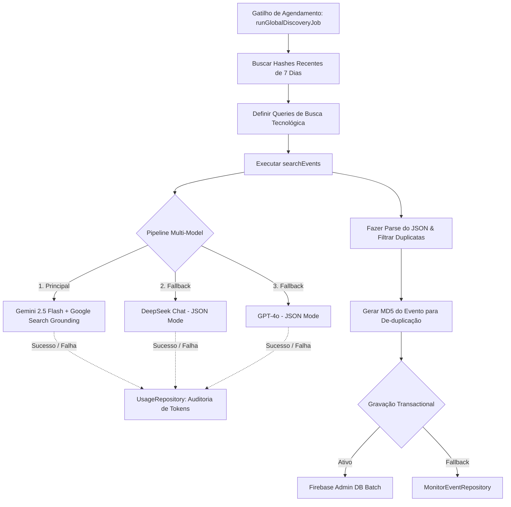

# ⚡ Event Discovery Engine: Ingestão de Dados e Pipeline Multi-Model Fallback

<- Voltar para o portal: [[AGENTS.md]] | Ver arquitetura: [[MASTER_ARCHITECTURE.md]] | Regras de Dados: [[MASTER_DOMAINS_AND_CONTRACTS.md]]

Este documento serve como a especificação de engenharia oficial do **Event Discovery Engine** (Motor de Descoberta de Eventos) da **Aimee**. Ele governa a ingestão de dados de eventos externos, a lógica de busca com Grounding (Google Search), a cascata polimórfica de provedores de IA (*Multi-Model Fallback*) e a gravação de alto desempenho com de-duplicação de banco de dados.

---

## 🏛️ 1. Visão Geral e Arquitetura do Fluxo

O Event Discovery Engine é um microsserviço assíncrono projetado para rodar de forma perene no ecossistema Aimee. Ele automatiza a mineração, validação e estruturação de eventos técnicos, acadêmicos e profissionais que ocorrem nas capitais brasileiras, disponibilizando-os como um feed centralizado e inteligente para os usuários.

O motor reside na classe de domínio `EventDiscoverySkill` (`src/domain/skills/EventDiscoverySkill.ts`) e integra repositórios e serviços de IA do BFF:



---

## 🔌 2. O Pipeline Multi-Model Fallback com Grounding

Para garantir **máxima resiliência operacional** contra indisponibilidades de APIs ou faturamento, o motor implementa um padrão de cascata sequencial entre os três principais provedores de IA integrados no projeto:

### 🟢 Fase 1: Gemini 2.5 Flash com Grounding (Foco em Factualidade)
*   **Modelo**: `gemini-2.5-flash`
*   **Diferencial Crítico**: Utiliza a ferramenta nativa de **Google Search Tool Grounding** (`tools: [{ googleSearch: {} }]`). Isso instrui o Gemini a realizar buscas na Web real em tempo de execução para obter eventos reais e futuros (meetups, Sympla, Eventbrite), neutralizando completamente o risco de alucinação de datas e preços.
*   **Temperatura**: `0.2` (Foco em extração sintática precisa).

### 🟡 Fase 2: DeepSeek Chat (Foco em Raciocínio Econômico)
*   **Modelo**: `deepseek-chat`
*   **Diferencial Crítico**: Ativado automaticamente como fallback se o Gemini falhar por limite de quota ou instabilidade de rede. Opera com o formato nativo `json_object` e consome uma tabela de instruções de sistema idêntica para manter a equivalência de dados.

### 🔴 Fase 3: OpenAI GPT-4o (Foco em Alta Compatibilidade)
*   **Modelo**: `gpt-4o`
*   **Diferencial Crítico**: Último nível de proteção de fallback. Sendo a API mais robusta e redundante do mercado, ela garante que o motor conclua seu ciclo diário de varredura mesmo em cenários de outage generalizado nos outros provedores.

---

## 📊 3. Modelo de Dados e Contrato de Saída (Taxonomia)

Toda IA chamada pela `EventDiscoverySkill` recebe uma instrução do sistema estrita (`systemInstruction`) exigindo que o retorno seja exclusivamente um JSON válido que respeite o seguinte esquema canônico:

```json
{
  "events": [
    {
      "titulo": "string",
      "resumo": "string (resumo curto de 1 a 2 frases)",
      "categorias": ["string"],
      "publico_alvo": "string",
      "data_inicio": "ISO8601",
      "data_fim": "ISO8601",
      "horario": "string (ex: 19:00)",
      "formato": "presencial | online | hibrido | desconhecido",
      "local": "string (nome do local ou plataforma)",
      "idioma": "string (ex: Português)",
      "custo": 0,
      "moeda": "BRL",
      "link_inscricao": "url",
      "link_fonte_origem": "url",
      "organizador": "string",
      "fonte": "dominio (ex: sympla.com.br)",
      "free_text_tags": ["string"],
      "tecnologias_mencionadas": ["string"],
      "foco_tecnico": ["string"],
      "raw_excerpt": "trecho curto original da fonte"
    }
  ]
}
```

---

## 🗃️ 4. O Mecanismo de De-duplicação e Gravação Segura

Uma operação massiva de raspagem ou extração de dados pode gerar custos operacionais altos se gravar repetidamente os mesmos registros. Para mitigar esse problema, o Event Discovery Engine implementa as seguintes etapas de otimização:

### 1. Hash Criptográfico Exclusivo (A Chave ID)
Para cada evento retornado pela IA, o motor gera um hash de integridade **MD5** combinando o título do evento, a data de início e a plataforma original de origem:

$$\text{Hash MD5} = \text{MD5}(\text{titulo} + \text{"-"} + \text{data\_inicio} + \text{"-"} + \text{fonte})$$

Esse hash de 32 caracteres é usado como o **document ID** físico da coleção `monitor_events` no Firestore. Isso garante que:
*   Se o mesmo evento for descoberto em queries diferentes ou dias consecutivos, o Firestore realiza apenas uma atualização parcial (*merge*) silenciosa, impedindo a duplicação física de documentos.
*   Leituras de rede do cliente no frontend permanecem limpas de itens repetidos.

### 2. Filtro de Hashes de Coleta Recente
Antes de chamar as APIs de IA para mineração, o motor varre o Firestore em busca de hashes que tenham sido coletados nos últimos 7 dias:

```typescript
const snapshot = await adminDb.collection('monitor_events')
  .where('collectedAt', '>=', recentDate.toISOString())
  .get();
```

Esse array de IDs é passado diretamente no prompt da IA como uma lista de restrição (`ignoreHashes`), instruindo-a ativamente a ignorar itens já persistidos, economizando processamento de IA e tokens de faturamento.

---

## 🛡️ 5. Resiliência de Gravação e Isolamento de Ambiente

O motor foi projetado para operar com segurança em ambientes de desenvolvimento local (onde as chaves de acesso administrativo de nuvem são restritas) e de produção (Vercel/Cloud Run com privilégios completos):

1.  **Gravação Privilegiada (Firebase Admin SDK)**: Em produção, o motor utiliza o **Admin SDK** do Firebase, ignorando regras padrão de segurança de cliente e realizando gravações transacionais ultra-rápidas em lote (*Firestore Batches*).
2.  **Fallback de Cliente (MonitorEventRepository)**: Se o contexto administrativo de banco de dados não estiver inicializado (por exemplo, em ambiente de testes locais ou emulação), o motor intercepta o erro e roteia de forma transparente a persistência utilizando o repositório de cliente convencional.

---

## 💰 6. Auditoria Ativa de Tokens

Ao final de cada ciclo de descoberta (seja bem-sucedido por qualquer uma das fases de IA), as métricas de metadados de tokens (`usageMetadata` para Gemini e `usage` para OpenAI/DeepSeek) são extraídas dos responses.

Essas métricas são persistidas no `UsageRepository` atreladas ao usuário sistêmico `system-event-discovery` sob o contexto de uso `event_discovery`. Isso fornece uma **rastreabilidade contábil** completa sobre o custo real da automação de mineração de dados no monorepo.
